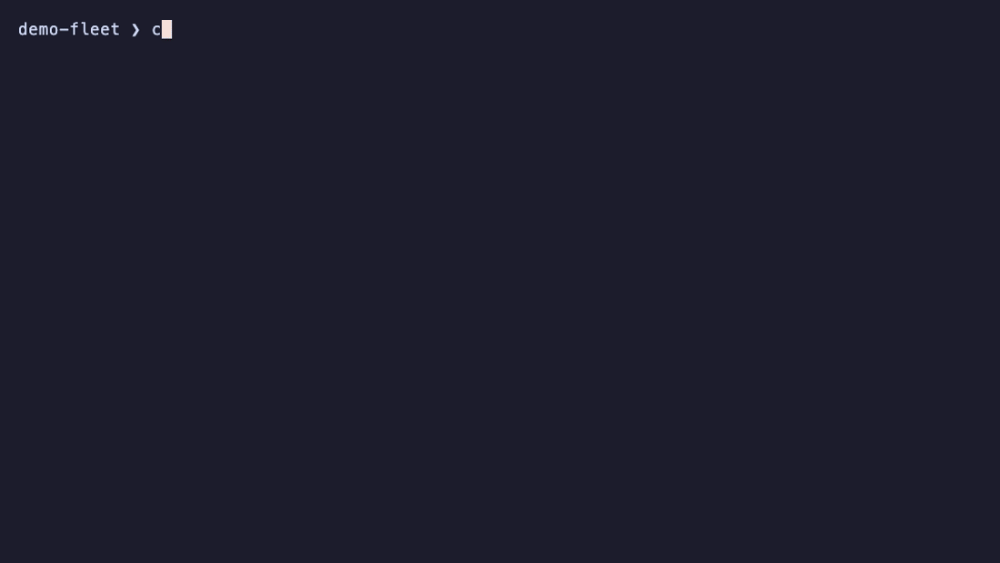

<div align="center">
  <picture>
    <source media="(prefers-color-scheme: dark)" srcset="docs/assets/logo-dark.svg">
    
  </picture>

  <h1>CodeRadius</h1>

  <p><strong>Prevent cross-repo architectural breakage before merge.</strong></p>

  <p>
    <a href="https://github.com/coderadius-ai/coderadius/actions/workflows/ci.yml"></a>
    <a href="LICENSE"></a>
    <a href="https://www.npmjs.com/package/coderadius"></a>
    <a href="https://modelcontextprotocol.io"></a>
  </p>

  <p>
    <a href="https://coderadius.ai/docs"><b>Documentation</b></a>
    ·
    <a href="https://coderadius.ai/acme-microservices-demo.html"><b>Live demo</b></a>
    ·
    <a href="#quick-start"><b>Quick start</b></a>
  </p>
</div>

As teams adopt AI coding tools, code is written faster than ever, but without global system context. CodeRadius statically builds a live knowledge graph of your entire architecture, covering every service, API, queue, and database across every repo, so engineers and AI agents can measure blast radius, enforce policy, and ship without breaking downstream systems.



*An innocent-looking rename in `order-service`; `cr blast` finds the consumer it breaks in `notification-service`, in seconds. [Explore the live demo dashboard →](https://coderadius.ai/acme-microservices-demo.html)*

---

## Why

AI coding agents are fast but architecturally blind. They will flawlessly refactor an API payload or rename a database field, unaware they just broke a downstream consumer three teams away. Even without AI, undocumented dependencies accumulate until every cross-service change turns into an archaeological dig.

CodeRadius fixes this with three capabilities on one graph:

- **Blast radius before merge**: `cr blast` is `terraform plan` for architecture. It provides an in-memory topological diff of your changes against the graph, returning structured findings in seconds. Semantic exit codes (`0` SAFE, `1` WATCH, `2` BREAKING) let CI and agents branch without parsing text.
- **Live context for AI agents**: A native [MCP](https://modelcontextprotocol.io) server lets any agent query data contracts, downstream consumers, and change impact *before* writing code.
- **Governance as code**: Declarative YAML policies evaluated against the live architecture graph, not file-level lint: unowned services, deprecated dependencies on exposed APIs, shared-database anti-patterns.

**Local-first.** Your code never leaves your machine: bring your own LLM key, or run fully local with Ollama. No telemetry. The only other network call is a once-daily version check (`CR_NO_UPDATE_CHECK=1` disables it).

---

## Project Status

CodeRadius is **0.x and moving fast**, released early to gather real-world feedback, not as a finished product.

What you can rely on today: the deterministic core (AST parsing, import and taint analysis, graph building, blast radius) is pinned by 5,400+ unit tests plus a deterministic eval suite, and every framework marked *eval-verified* in the [compatibility matrix](docs/guide/supported-frameworks.md) is regression-gated by committed fixtures.

What is still settling: LLM semantic extraction quality varies by stack and provider, and the graph schema and CLI surface may change between 0.x releases without migration paths (re-ingesting is the upgrade path).

If it breaks on your codebase, that's exactly the feedback we need. Please [open an issue](https://github.com/coderadius-ai/coderadius/issues) with the `cr --version` output and the language/framework involved.

---

## Quick Start

Requirements: Docker (for the local graph database). The CLI ships as a self-contained binary for macOS and Linux (x64/arm64), nothing else to install.

```bash
npm i -g coderadius     # or: bun add -g coderadius
```

or without a package manager:

```bash
curl -fsSL https://raw.githubusercontent.com/coderadius-ai/coderadius/main/scripts/install.sh | bash
```

To run from source instead (contributors; requires [Bun](https://bun.sh) ≥ 1.0 and Node.js ≥ 22):

```bash
git clone https://github.com/coderadius-ai/coderadius.git
cd coderadius
bun install
bun link        # exposes the `cr` binary globally (runs from source, no build step)
```

Then, from the repo you want to analyze:

```bash
cr init                              # configure your LLM provider, generate a smart .crignore
cr up                                # start the local graph database (Memgraph via Docker)

cr analyze code .                    # build the graph (default: --depth semantic)
cr analyze code . --depth structure  # AST-only scan, zero LLM calls
cr analyze code . --depth contracts  # full semantic extraction with data contracts

cr blast                             # blast radius of your current changes vs origin/main
cr blast feature/checkout            # blast radius of a branch (shorthand for --head)
cr ui                                # generate the architecture dashboard
cr mcp start                         # MCP server for your IDE agent
```

Analyze multiple repos into the same graph (`cr analyze code ../orders ../payments ../shipping`) and blast radius becomes cross-repo.

---

## How It Works

Unlike observability tools that rely on runtime traffic, CodeRadius builds its graph *statically* through a four-stage pipeline:

1. **Auto-Discovery**: Detects service boundaries, monorepos, and multi-repo architectures from your codebase or Backstage catalogs.
2. **Taint Analysis Engine**: Tree-sitter AST parsing identifies *only* the functions that perform external I/O (HTTP calls, DB queries, message broker events). Pure business logic is ignored. The taint engine filters approximately 85% of functions before a single LLM token is spent.
3. **Semantic Extraction**: Tainted functions are sent to your chosen LLM to extract intents, payloads, and infrastructure dependencies. A Merkle hash cache makes incremental runs take seconds instead of hours.
4. **Global Edge Resolution**: Matches emergent client calls in Service A to canonical OpenAPI endpoints in Service B, bridging the cross-repo gap.

Every node and edge carries [grounding](docs/guide/grounding.md): who produced the fact (AST, LLM, declaration, infra), the supporting evidence, and how much to trust it.

Built on Bun, tree-sitter, Mastra + Vercel AI SDK, and Memgraph.

---

## MCP Server

CodeRadius ships a native MCP server that plugs into any MCP-compatible agent (Claude Code, Cursor, Windsurf, Gemini CLI). The agent discovers these tools and checks impact before writing code:

```json
{
  "mcpServers": {
    "coderadius": {
      "command": "cr",
      "args": ["mcp", "start"]
    }
  }
}
```

| Tool | Purpose for the Agent |
|------|------------------------|
| `resolve_service_context` | Orient the agent: map a file path, git remote, or repo name to its service, team, and repository. |
| `list_services` | Inventory all services with owners, languages, and deployment topology. |
| `get_service_details` | Deep-dive one service: exposed APIs, endpoint counts, deployment units, CI/CD and Docker infrastructure. |
| `get_repository_details` | Repository posture: services, pipelines, Docker images, tool configurations, build tasks, commit liveness. |
| `get_data_contract` | Exact schema (fields and types) of a payload, event, or database table, before modifying it. |
| `analyze_blast_radius` | Upstream producers and downstream consumers of a resource (table, channel, endpoint). |
| `evaluate_code_change_impact` | Blast radius of a proposed change via in-memory topological diff, before committing. |
| `trace_data_lineage` | Follow a data field across services, brokers, and APIs. |
| `analyze_architecture_gravity` | SPOFs, shared-database anti-patterns, and coupling hotspots ranked by score. |
| `analyze_agentic_context` | AI-tooling adoption per repository: tools, configurations, skills, workflows. |

Full guide: [docs/guide/mcp-server.md](docs/guide/mcp-server.md)

---

## Current Support

**Languages**: TypeScript · PHP · Python · Go · Java

**Frameworks (eval-verified)**: NestJS · Express · Fastify · Hono · Koa · Symfony · Laravel · Slim · Spring Boot · JAX-RS

**Frameworks (heuristic + LLM)**: FastAPI · Flask · Django · Gin · Fiber

**Protocols & infra**: REST · OpenAPI · GraphQL · RabbitMQ · Google Pub/Sub · PostgreSQL · MySQL

**CI/CD ingestion**: GitHub Actions · GitLab CI

**LLM providers**: Google Vertex AI · Google Gemini API · OpenAI · Anthropic · Amazon Bedrock · Ollama (fully local, no API key)

→ [Full compatibility matrix](docs/guide/supported-frameworks.md)

---

## Beyond the Basics

- **Architecture Dashboard**: Self-contained HTML report with service inventory, SPOF analysis, governance violations, and dependency health (`cr ui`).
- **Agent Harness**: Maps AI tooling adoption across the fleet: maturity levels, context gaps, team coverage.
- **Runtime Traces**: Overlay Datadog/Jaeger traces (`cr analyze traces`) on the static graph to validate architecture against reality.
- **Living Docs**: Auto-generate `ARCHITECTURE.md` for any service (`cr docs generate`).

---

## Documentation

- **User guide**: [docs/guide/](docs/guide/) including [introduction](docs/guide/introduction.md), [CLI commands](docs/guide/cli-commands.md), [impact evaluation](docs/guide/impact-evaluation.md), [governance policies](docs/guide/governance.md), [configuration](docs/guide/coderadius-yaml.md)
- **Architecture deep-dives**: [docs/architecture/](docs/architecture/) covering ingestion pipeline, graph data model, API-endpoint dedup, service topology, grounding contract

---

## Roadmap

- **Languages**: C#, Ruby
- **CI/CD config ingestion**: Bitbucket Pipelines, Jenkins (running `cr blast` inside any CI already works today, Bitbucket included; see the compatibility matrix)

---

## Contributing

Contributions are welcome. Language plugins, framework signals, and connection extractors are designed as isolated extension points. See [CONTRIBUTING.md](CONTRIBUTING.md).

---

## License

[Apache-2.0](LICENSE)
