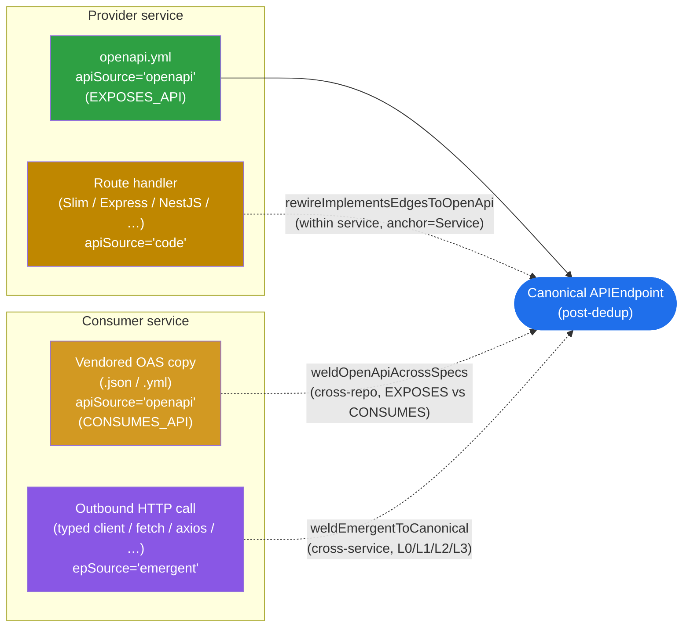

# API Endpoint Dedup & Cross-Service Matchmaking

How CodeRadius prevents duplicate `APIEndpoint` nodes when the same logical
route is described by multiple producers (OpenAPI spec, code-inferred route
handler, LLM-discovered HTTP call) and how it joins consumer→provider edges
across services without colliding paths from different industry domains.

## Convergence at a glance



The authoritative OpenAPI node (the one EXPOSES_API'd by the implementing
service) is the single survivor. Three convergence paths feed into it:

- **`rewireImplementsEdgesToOpenApi`** rewires the within-service code-inferred
  endpoint and tombstones it.
- **`weldOpenApiAcrossSpecs`** reconciles vendored OAS copies (CONSUMES_API)
  by moving inbound `[:CALLS]` to the authoritative endpoint and tombstoning
  the vendored ones. Skips ambiguous routes where multiple providers EXPOSES
  the same path.
- **`weldEmergentToCanonical`** moves emergent (LLM-inferred) outbound calls
  to the canonical via the L0/L1/L2/L3 funnel and `DETACH DELETE`s the
  emergent node.

## Source taxonomy

Every `APIEndpoint` carries an `epSource` property and every `APIInterface`
carries an `apiSource` property. These are the discriminators the dedup logic
uses; URN parsing is forbidden (AD-5). The property literally named `source`
holds the unrelated grounding tier (`ast`/`heuristic`/`llm`/`composite`/…), 
not a domain discriminator.

| `epSource` | Producer | URN scheme |
|---|---|---|
| `openapi` | `extractors/openapi-extractor.ts` (parses `*.yaml`/`*.json` specs) | `cr:endpoint:{repo}:{spec}:{METHOD}:{path}` |
| `code` | `code-pipeline/graph-writer.ts` for INBOUND route handlers (Slim, Express, NestJS, …) | `cr:endpoint:code:{METHOD}:{path}` |
| `emergent` | `code-pipeline/graph-writer.ts` for OUTBOUND HTTP calls (LLM-detected, Zodios) | `cr:endpoint:emergent:{METHOD}:{path}` |
| `sdl` | `extractors/graphql-schema-extractor.ts` | `cr:endpoint:graphql:{apiUrn}:{op}:{name}` |
| `code` (GraphQL) | `code-pipeline/graph-writer.ts` GraphQL fork | `cr:endpoint:graphql-code:{apiUrn}:{op}:{name}` |
| `emergent` (GraphQL) | outbound GraphQL operations | `cr:endpoint:emergent-graphql:{callerSvc}:{op}:{name}` |

### HTTP vs GraphQL emergent: a deliberate URN asymmetry

The two emergent flavours are scoped differently on purpose:

- **HTTP emergent URNs are caller-agnostic** (`cr:endpoint:emergent:METHOD:path`).
  When `service-A` and `service-B` both call `POST /api/pay`, the merge
  collapses them into a single emergent node and the global resolver welds it
  once into the canonical provider endpoint. Both callers' `[:CALLS]` edges
  move atomically. The graph stays compact and the consumer-fan-in is visible
  on a single canonical node.
- **GraphQL emergent URNs include the caller service**
  (`cr:endpoint:emergent-graphql:{callerSvc}:OP:NAME`). GraphQL operation names
  collide far more often than HTTP routes (`getUser`, `createOrder`) and the
  semantic surface depends on the document fragment that the caller actually
  sent. Scoping prevents two unrelated services from being silently fused on
  an operation name and lets the SDL weld preserve per-caller document
  metadata (`documentName`) before deletion.

The asymmetry is reflected in the welding code: the HTTP `weldEmergentToCanonical`
must walk inbound `[:CALLS]` edges from arbitrarily many callers; the GraphQL
weld is a 1:1 weld per caller-service.

Importantly, `apiSource` lives on the `APIInterface` and `epSource` lives on the
`APIEndpoint`. `mergeAPIInterface(...)` accepts a 5th argument
`apiSource: 'openapi' | 'sdl' | 'code' | 'env-var'` (default `'openapi'`),
stored as `api.apiSource`. Each merge function for endpoints sets `ep.epSource`
itself.

## Path canonicalization

Producers MUST write paths through the same canonicalization. Today:

- `code-pipeline/graph-writer.ts` and `extractors/openapi-extractor.ts` both
  call `normalizeApiPathLossless(path)`.

`normalizeApiPathLossless` (`processors/api-path-utils.ts`) strips
`protocol://host:port`, query string, fragment, doubled `/`, trailing `/`, and
converts legacy `:param` syntax to `{param}`, but preserves existing
`{varName}` placeholders verbatim (it does not collapse arbitrary `{anything}`
to `{param}`). This guarantees that the rewire's RAW path comparison is
reliable. **Do not introduce a new producer that uses a different
normalization.**

`normalizeApiPath` is a *lossy* variant used only at MATCH time inside the
global resolver. It additionally strips `/api/vN/` prefixes for fallback
matching. It is never used for storage.

## HTTP rewire (within a service)

`rewireImplementsEdgesToOpenApi(serviceUrn)` is invoked per service during
matchmaking (`processors/matchmaking.ts:172`). It re-points
`(:Function)-[:IMPLEMENTS_ENDPOINT]->(:APIEndpoint)` from the code-inferred
endpoint to the OpenAPI endpoint when both exist on the same service for the
same `(method, path)`, then tombstones the code-inferred endpoint if no other
service still implements it.

```
MATCH (s:Service {id: $serviceUrn})
      -[:EXPOSES_API]->(openApi:APIInterface {apiSource:'openapi'})
      -[:HAS_ENDPOINT]->(openEp)
MATCH (s)-[:EXPOSES_API]->(codeApi:APIInterface {apiSource:'code'})
      -[:HAS_ENDPOINT]->(codeEp)
WHERE toUpper(openEp.method) = toUpper(codeEp.method)
  AND openEp.path = codeEp.path
OPTIONAL MATCH (s)-[:CONTAINS]->(f:Function)-[oldRel:IMPLEMENTS_ENDPOINT]->(codeEp)
... rewire to openEp, delete oldRel ...
// tombstone codeEp only if no other service still has IMPLEMENTS_ENDPOINT to it
```

### Multi-tenant safety

The `(s:Service {id: $serviceUrn})` anchor on **both** sides is required.
Code-inferred endpoint URNs are not service-scoped (`cr:endpoint:code:M:PATH`),
so the same node can be reachable from multiple services that share a path
(legitimately: `team-a/health` and `team-b/health`). The
`(s)-[:CONTAINS]->(f)` clause on the OPTIONAL MATCH guarantees we only rewire
edges originating from functions owned by THIS service. The tombstone is
gated on `count(otherImplementers) = 0` so a shared code-inferred node stays
alive while other services still depend on it.

## GraphQL parity

`rewireGraphQLCodeToSDL(serviceUrn)` filters on `APIEndpoint.epSource` (`'code'`
↔ `'sdl'`) and `APIEndpoint.apiKind = 'graphql'`. It does NOT depend on
`APIInterface.apiSource`, so it survived the historical bug where the SDL
APIInterface lacked an `apiSource` property. It joins via the owning
`Service`, not any API-interface property. The interface is now correctly
stamped via `mergeAPIInterface(..., 'sdl')`.

GraphQL emergent endpoints have caller-service-scoped URNs
(`cr:endpoint:emergent-graphql:{callerSvc}:...`), so cross-service collisions
cannot happen and there is no need for a `(s:Service)` anchor in the GQL weld.

## Cross-spec OpenAPI weld (vendored copies → authoritative)

Consumer repos commonly **vendor** a copy of the provider's OpenAPI spec
under e.g. `infrastructure/{provider}/oas/{provider}.oas.{json,yml}` to drive
type generation (Zodios, openapi-typescript, …). Each spec file produces a
distinct `APIInterface` (URN includes the file path), so the same logical
route ends up with several `APIEndpoint` nodes (one per spec file).

`reclassifyConsumedAPIs` (`processors/matchmaking.ts` step) demotes the
consumer-side `APIInterface` from `EXPOSES_API` to `CONSUMES_API` once it
detects no implementing code on that side. Immediately after, the workflow
runs `weldOpenApiAcrossSpecs` (`api-contracts.ts:weldOpenApiAcrossSpecs`):

```
For each (consumerEp.method, consumerEp.path) where consumerEp belongs to a
CONSUMES_API APIInterface:
  • find every OpenAPI APIEndpoint with the same (method, path) on a
    different APIInterface that has at least one EXPOSES_API service
  • if exactly ONE such authoritative endpoint exists → weld
  • otherwise → record as ambiguous and skip
```

Welding moves all inbound `[:CALLS]` from the consumer-side endpoint to the
authoritative one, then sets `consumerEp.valid_to_commit` (tombstone) and
records `consumerEp.welded_into = <authoritativeId>`. The
`(:APIInterface)-[:HAS_ENDPOINT]->(consumerEp)` edge is left in place so the
consumer's contract picture remains queryable, but the endpoint stops
competing in matchmaking. The authoritative node remains the only "live"
participant for blast-radius traversals.

### Multi-tenant safety

- The weld requires AT LEAST ONE service to currently `EXPOSES_API` the
  authoritative interface. We never invent a canonical, never weld two
  `CONSUMES_API` together.
- If multiple authoritative candidates exist for the same `(method, path)`
  (e.g. two providers both expose `/health`), the weld is **skipped** for
  that route and the ambiguity is surfaced in the workflow output. We do
  not guess.

## Cross-service welding (emergent → canonical)

`processors/global-resolver.ts` runs at the end of code ingestion. It welds
emergent endpoints (consumer-side) into the canonical endpoint exposed by the
provider service. Three-level funnel:

| Level | Mechanism | Cross-service safety |
|---|---|---|
| L0 scoped | `getScopedCandidatesForEmergent` traverses `Caller→DEPENDS_ON→Target→EXPOSES_API→APIInterface→HAS_ENDPOINT` | Safe: only reaches services the caller depends on |
| L0b self-service | Same as L0 but without `DEPENDS_ON` (caller and provider are the same service) | Safe: single service |
| L1 exact | `normalizeApiPath` equality across the entire canonical set | **Cross-service by design** (intended fallback) |
| L2 template | OpenAPI parameter regex against entire set | Cross-service fallback |
| L3 LLM | matchmaker agent (only `--depth contracts`) | Cross-service fallback |

`weldEmergentToCanonical` moves all `[:CALLS]` from the emergent endpoint to
the canonical, then `DETACH DELETE`s the emergent if it has no remaining
inbound callers.

### `DEPENDS_ON` sources

Producers of `(Service)-[:DEPENDS_ON]->(Service)` edges:

1. **Backstage / Cortex catalog** (`topology-resolver.ts:922`): declared
   dependencies from `catalog-info.yaml` / Cortex YAML. Provenance is appended
   to the array property `rel.depSources` (e.g. `['backstage']`). The scalar
   `rel.source` holds the unrelated grounding tier (`'declared'`).
2. **Env-var URL resolver** (`service-host-to-dependency-resolver.ts`): for
   each repo, resolves env vars to URL values, extracts the host, and matches
   the host's leftmost label against the global Service inventory. On exact
   service-name match (or unique repo-basename match), writes a cross-repo
   `DEPENDS_ON` with `rel.depSources` containing `'env-var'` and
   `rel.package=<envVarKey>`. The edge is otherwise untagged-grounding
   (`rel.source='heuristic'`, `needsReview=true`) since no explicit grounding
   is passed at this call site. Loopback and sentinel hosts are dropped;
   ambiguous service-name matches are deferred to the LLM rather than written
   speculatively.
3. **Lockfile** (`lockfile-extractor.ts:79`): produces
   `(Repository)-[:DEPENDS_ON]->(Package)` edges (not Service→Service). Does
   not feed L0.

The env-var resolver runs BEFORE `ingestGlobalResolution()` so the L0-scoped
GraphQL pass has cross-repo candidates to weld against without depending on
catalog presence. The dashboard should distinguish env-var-sourced edges
(`rel.depSources` containing `'env-var'`, untagged grounding) from
catalog-declared edges (`rel.depSources` containing `'backstage'`/`'cortex'`,
grounding `source:'declared'`).

## Workflow ordering

`code-ingestion.workflow.ts`'s "Synthesizing Architecture Graph" step runs,
in order (post analysis, post symbol persistence):

1. `Matching API Endpoints`: runs `ingestMatchmaking`, which invokes
   `rewireImplementsEdgesToOpenApi` and `rewireGraphQLCodeToSDL` per service.
2. `Resolving Cross-Service Calls`: `ingestGlobalResolution` welds emergent
   endpoints (HTTP + GraphQL) into canonical providers via the L0/L1/L2/L3
   funnel.

A later, separate "Reconciling Graph State" step then invokes `runReconcile()`
(`reconcile.workflow.ts`), which runs, among many other welders:

3. `Classifying API Roles`: `reclassifyConsumedAPIs` demotes
   non-implementing OpenAPI specs from EXPOSES_API to CONSUMES_API.
4. `Welding Cross-Spec OpenAPI Duplicates`: `weldOpenApiAcrossSpecs` reconciles
   vendored OAS copies into the authoritative endpoint.
5. `Resolving Cross-Repo Service Dependencies (env-var hosts)`:
   `resolveServiceDependenciesFromEnvVars` writes `Service-DEPENDS_ON-Service`
   edges tagged `'env-var'` in `rel.depSources`.

## GraphQL emergent classification (deterministic floor)

`(Service)-[:DEPENDS_ON]->(Service)` alone does not produce
`emergent-graphql` endpoints. Three layers cooperate to ensure consumer-side
GraphQL calls become deterministic emergents *before* reaching the
matchmaker LLM:

1. **`coderadius.yaml > decorators[kind:'graphql-client']`**: the user
   declares an opaque GraphQL wrapper once (e.g.
   `name: "AcmeShop\\Inventory\\OrdersClient::post"`). The shared
   `graphql-client-registry` (`src/ingestion/core/graphql-client-registry.ts`)
   is consulted by the PHP `extractStaticSupplements` and emits
   `ClientBinding{protocol:'graphql', clientKind:'sdk'}` for any chunk that
   imports the configured class and calls the configured method. This
   short-circuits the LLM for statically resolvable wrappers. Matching is
   namespace-separator-tolerant (`\\`, `\`, `/` all canonicalised).

2. **`.gql` / `.graphql` operation file index**:
   `graphql-operations-extractor.ts` walks the consumer repo for
   OperationDefinition documents and emits a SYNTHETIC INDEX of
   `{operationType, operationName, rootField}` keyed by absolute path,
   relative path, and unique basename. The index is per-repo. Basename
   collisions are dropped (fail-closed).

   At analysis time, `enrichAnalysisResults` scans only the current chunk's
   own source for quoted `.gql` / `.graphql` literals (e.g.
   `file_get_contents(__DIR__ . '/Mutation/InitSave.gql')`) and injects
   AT MOST one entry of `graphQLDocumentContext` per task. The full file
   body is NEVER pushed to the LLM. This is the rule that prevents
   prompt-size blow-ups in repos with hundreds of `.gql` files.

3. **Sanitizer body-shape rule** (`reclassifyEmergentToGraphQL` in
   `sanitizer.ts`): defense-in-depth net for cases where layers (1) and
   (2) didn't fire. Scans the function's source for an inline operation
   declaration `(query|mutation|subscription)\s+<Name>\s*[({]` and rewrites
   any plain-HTTP OUTBOUND emergent on the same chunk to the canonical
   `'GRAPHQL <OP> <Name>'` shape with `protocol:'graphql'`. The trailing
   `(` or `{` anchor avoids false positives from REST endpoints that
   happen to accept a `query` parameter.

The emergent-graphql URN remains caller-scoped
(`cr:endpoint:emergent-graphql:{callerServiceUrn}:{operation}:{operationName}`).
Two consumers calling the same provider mutation each produce a distinct
emergent that both weld to the single SDL canonical. This is intentional. It
preserves the per-caller blast-radius story.

The order matters: cross-spec weld must run AFTER reclassification (it relies
on the EXPOSES_API vs CONSUMES_API discrimination). Today it also runs AFTER
global resolution. `weldOpenApiAcrossSpecs` and `reclassifyConsumedAPIs` are
part of `reconcile.workflow.ts`'s `runReconcile()`, which fires as a terminal
step following the `ingestGlobalResolution()` call inside
`code-ingestion.workflow.ts` (see "Workflow ordering" above).

## Performance: secondary indexes

Cross-spec weld and the global resolver join on `(method, path, epSource)` of
`APIEndpoint` and on `apiSource` of `APIInterface`. Without secondary indexes,
Memgraph would scan the cartesian product of all OpenAPI endpoints. This would
quickly become O(N²) for polyrepo setups with thousands of endpoints and
multiple vendoring services.

`initSchema` (`src/graph/neo4j.ts`) creates these single-property indexes
automatically on every startup (idempotent: `CREATE INDEX` is silently
skipped if it already exists). The list lives in `domain.ts` under
`SECONDARY_INDEXES`:

- `:APIEndpoint(path)`: primary join key for cross-spec weld and global resolver
- `:APIEndpoint(method)`: pre-filters candidates by HTTP method
- `:APIEndpoint(source)`: indexes the **grounding tier**, not `epSource`
- `:APIInterface(source)`: indexes the **grounding tier**, not `apiSource`

Note: the `source` indexed above is the grounding-tier field
(`ast`/`heuristic`/`llm`/…), not the `apiSource`/`epSource` domain
discriminator the dedup joins actually filter on. There is currently no
secondary index on `apiSource` or `epSource`, which is an open performance
gap for the joins described above.

To inspect on a live instance: `SHOW INDEX INFO;` should list all four as
`label+property` indexes, plus the existing `label+property_vector` indexes
on `embedding` fields.

If a future query bottleneck shows up in profiling (`PROFILE <cypher>`),
add the relevant property to `SECONDARY_INDEXES` rather than hand-crafting
a one-off DDL. That way the index lives with the schema and survives
fresh-DB initialization.

## Bug history (regression hooks)

- **Bug A** (in an earlier revision): `mergeAPIInterface` did not stamp
  `apiSource`, so `rewireImplementsEdgesToOpenApi`'s filter
  `(openApi:APIInterface {apiSource:'openapi'})` never matched. Both code-inferred
  AND OpenAPI endpoints survived per route (duplicates).
  Regression: `tests/integration/api-contracts-rewire.test.ts > rewireImplementsEdgesToOpenApi fuses code-inferred to OpenAPI within the same service`.
- **Bug B** (same revision): OpenAPI extractor used `normalizePathParams` only
  while graph-writer used `normalizeApiPathLossless`, so trailing slashes,
  doubled `/`, and query strings desynchronized the raw path equality.
  Regression: `tests/unit/ingestion/endpoint-normalizer.test.ts > write-time path symmetry (Bug B regression)` and
  `tests/integration/api-contracts-rewire.test.ts > Bug B regression`.
- **GraphQL SDL version corruption**: `graphql-schema-extractor.ts:276` (see
  the historical-bug comment at `:272-275`) used to pass `'sdl'` as the
  `version` parameter (third arg). Fixed alongside Bug A by introducing the
  explicit `apiSource` parameter.
  Regression: `tests/integration/api-contracts-rewire.test.ts > mergeAPIInterface accepts explicit "sdl" source without corrupting version`.
- **Bug C** (vendored cross-spec duplicates): consumers vendor a copy of the
  provider's OpenAPI spec (often as both `.json` and `.yml`). Before `weldOpenApiAcrossSpecs`,
  this produced 2-3 distinct `APIEndpoint` nodes per logical route with
  identical `(method, path)` but different URNs. Consumer Functions emitted
  `[:CALLS]` to the vendored copy while provider Functions emitted
  `[:IMPLEMENTS_ENDPOINT]` to the authoritative one. Same logical route,
  no graph-level join.
  Regression: `tests/integration/api-contracts-cross-spec-weld.test.ts`.
- **Bug D** (PHP route extractor collapsed every var name to `{param}`):
  `route-extractor-php.ts:normalizePhpPath` used to rewrite `{saveId}` to
  `{param}` and `:id` to `{param}`. OpenAPI extractor (after Bug B fix)
  preserves the var name, so the rewire's raw-path equality couldn't fuse
  `code` `{param}` with `openapi` `{saveId}`. Now the PHP extractor preserves
  the var name verbatim (`{saveId}`, `{id}`, …). Only `*` (anonymous wildcard)
  becomes `{splat}`. Synthetic Laravel `Route::resource()` and API Platform
  resources use `{id}` as their canonical fallback (REST convention).
  Regression: `tests/unit/ingestion/processors/route-extractor-php.test.ts > normalizePhpPath() > {id} preserved (lossless)`.
