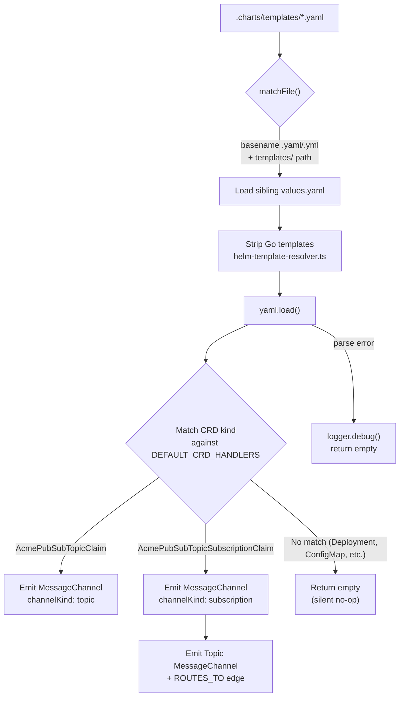
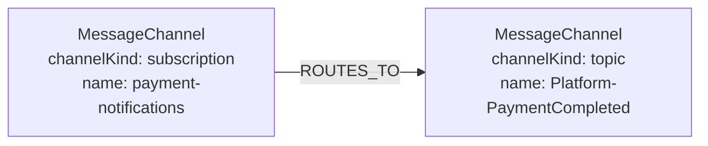

# Contrib Plugin System & Crossplane PubSub Extraction

The **contrib plugin system** extends CodeRadius's structural extraction layer with domain-specific infrastructure plugins. These plugins extract topology from IaC files (Helm charts, Crossplane CRDs, Terraform modules) without contaminating the core ingestion pipeline.

---

## 1. Overview

### Why Contrib Plugins Exist

Some platforms use domain-specific Kubernetes Custom Resource Definitions (CRDs) to declare infrastructure: PubSub topics, database instances, CDN distributions, etc. These CRDs carry critical dependency information that the core code analysis pipeline cannot discover. They live in Helm chart templates, not in application code.

Contrib plugins solve this by:

- **Extracting infrastructure topology** from IaC files deterministically (zero LLM)
- **Emitting graph nodes and edges** that the core pipeline can link to (e.g., `ROUTES_TO` between a subscription and a topic)
- **Staying physically isolated** in `src/ingestion/structural/plugins/contrib/` to prevent core contamination

### Directory Convention

```
src/ingestion/structural/plugins/
├── makefile.plugin.ts                       # Core plugin
├── dockerfile.plugin.ts                     # Core plugin
├── ...                                      # Core plugins
├── contrib/                                 # Domain-specific plugins
│   ├── crossplane-pubsub.plugin.ts          # Crossplane CRD → Pub/Sub topology
│   └── helm-template-resolver.ts            # Shared Helm utility
└── messaging/                               # Broker-topology family
    ├── messaging-helpers.ts                 # DSN parsing + broker resolution
    ├── rabbitmq-config.plugin.ts            # rabbitmq-definitions.json + rabbitmq.conf
    └── symfony-messenger.plugin.ts          # config/packages/messenger.yaml
```

### Lifecycle

Contrib plugins are **always loaded** by the plugin manager. They participate in the exact same lifecycle as core plugins: `matchFile()` → `extract()` → reconcile.

Safety is guaranteed by design:
- `matchFile()` only triggers on Helm template YAML files
- `extract()` only emits entities when it finds matching CRD `kind` values
- On repos without Crossplane CRDs, the plugin is a **silent no-op** (zero entities, zero log output)

---

## 2. Plugin Contract Extension: `StructuralEntity.edges`

### The Problem

The original `StructuralEntity` contract only supports edges FROM a `StructuralFile` TO the extracted entity. It cannot express relationships BETWEEN entities (e.g., a subscription that `ROUTES_TO` a topic).

### The Solution

The `StructuralEntity` interface was extended with an optional `edges` array:

```typescript
export interface StructuralEntity {
    id: string;
    labels: string[];
    properties: Record<string, unknown>;
    relationshipType: string;

    /** Additional edges to create between emitted entities (or existing graph nodes). */
    edges?: Array<{
        sourceUrn: string;
        targetUrn: string;
        type: string;
        /**
         * Edge-level properties (since the messaging plugins). Used to carry
         * routing metadata (bindingKey, isPattern, patternRegex, …) on
         * ROUTES_TO edges, or declaredVia/confidence on MANIFESTS_AS edges.
         */
        properties?: Record<string, unknown>;
    }>;
}
```

The allowed edge types are gated by an explicit whitelist in `structural/queries.ts:ALLOWED_EDGE_TYPES` to defend against Cypher injection. Current entries: `ROUTES_TO`, `PROVISIONS`, `DEPENDS_ON`, `LINKS_TO`, `REFERENCES`, `HOSTED_ON`, `MANIFESTS_AS`, `BACKED_BY`, `DEAD_LETTERS_TO`.

### Persistence

After all entities are persisted (step 8 in the plugin manager), a dedicated pass creates edges:

```typescript
// ── 8.1. Persist inter-entity edges from plugins ─────────────────
for (const entity of allEntities) {
    if (entity.edges) {
        for (const edge of entity.edges) {
            await structQueries.mergeStructuralEdge(
                edge.sourceUrn, edge.targetUrn, edge.type, edge.properties,
            );
        }
    }
}
```

### Design Rationale

**Declarative over imperative.** Edges are pure data (`{ sourceUrn, targetUrn, type }`) rather than imperative lifecycle hooks (`postPersist()`). This makes plugins stateless, testable, and debuggable. The entire plugin output is a single `(file) => { entities, edges }` function.

### Security

Relationship types are validated against a whitelist (`ALLOWED_EDGE_TYPES` in `queries.ts`) to prevent Cypher injection. Although plugin code is trusted, defense-in-depth is enforced:

| Allowed Type | Use Case |
|---|---|
| `ROUTES_TO` | PubSub subscription → topic |
| `DEPENDS_ON` | Terraform module dependencies |
| `LINKS_TO` | ArgoCD application → service |
| `REFERENCES` | Generic cross-entity reference |

### Future Use Cases

| Plugin | Edge Type | Description |
|---|---|---|
| Crossplane PubSub | `ROUTES_TO` | Subscription → Topic (active) |
| RabbitMQ config | `ROUTES_TO` + `HOSTED_ON` | Binding + broker hosting (active) |
| Symfony Messenger | `MANIFESTS_AS` + `BACKED_BY` | Logical → transport → physical (active) |
| Terraform Modules | `DEPENDS_ON` | Module → Module |
| ArgoCD Applications | `LINKS_TO` | Application → Service |
| Docker-Compose | `LINKS_TO` | Service → Service |

---

## 3. Crossplane PubSub Plugin Architecture

### Extraction Flow



### Graph Output

For a repo with both `topic.yaml` and `subscription.yaml` Helm templates:



### Matched File Patterns

| Pattern | Example |
|---|---|
| `.charts/templates/*.yaml` | `.charts/templates/topic.yaml` |
| `charts/*/templates/*.yaml` | `charts/my-svc/templates/subscription.yaml` |
| `helm/templates/*.yaml` | `helm/templates/claim.yaml` |
| `deploy/templates/*.yaml` | `deploy/templates/topic.yaml` |

---

## 4. CRD Handler Registry

The **only CRD-specific code** in the entire plugin is the `DEFAULT_CRD_HANDLERS` array (~20 lines). Each entry maps a Kubernetes CRD `kind` to the `MessageChannel` semantics it represents.

### Current Entries

| CRD Kind | Channel Kind | Name Field | Topic Field | Technology |
|---|---|---|---|---|
| `AcmePubSubTopicClaim` | `topic` | `spec.topicId` | (not applicable) | `pubsub` |
| `AcmePubSubTopicSubscriptionClaim` | `subscription` | `spec.topicId` | `spec.topicId` | `pubsub` |

### Adding a New CRD

The preferred, code-free way to register a new CRD is via `coderadius.yaml`.
`getCrossplaneCrds(loadRepoHints(repoRoot))` merges user-declared CRDs into the
handler set at runtime, so end users can register a new `kind` without
touching plugin source:

```yaml
# coderadius.yaml
crossplane:
  crds:
    - kind: KafkaTopic
      channelKind: topic
      nameField: metadata.name
      technology: kafka
```

To ship a new CRD as a built-in default instead, add an entry to
`DEFAULT_CRD_HANDLERS`:

```typescript
// Example: Strimzi KafkaTopic CRD
{
    kind: 'KafkaTopic',
    channelKind: 'topic',
    nameField: 'metadata.name',
    technology: 'kafka',
},
```

If the new CRD introduces new node labels, register them in the graph schema (`src/graph/domain.ts`).

---

## 5. Helm Template Resolution Strategy

**Entrypoint**: `src/ingestion/structural/plugins/contrib/helm-template-resolver.ts`

This utility strips Go template syntax from Helm YAML files to make them parseable by `js-yaml`, then resolves `{{ $.Values.x.y.z }}` references against the chart's `values.yaml`.

### Functions

| Function | Purpose |
|---|---|
| `stripGoTemplates(content)` | Replace `{{ $.Values.x }}` with placeholders, delete control flow blocks |
| `resolveHelmValue(values, dotPath)` | Resolve a dot-path against a parsed values object |
| `resolvePlaceholders(text, values)` | Replace `__CR_VAL_x|y__` placeholders with resolved values |
| `findValuesFile(templateAbsPath)` | Walk up from template to find sibling `values.yaml` |
| `extractValuesPaths(content)` | List all `$.Values.*` dot-paths referenced in a template |

### Go Template Handling

| Template Pattern | Action |
|---|---|
| `{{ $.Values.x.y }}` | → `__CR_VAL_x\|y__` placeholder |
| `{{ $.Values.x \| lower }}` | → `__CR_VAL_x__` (pipe filters stripped) |
| `{{ .Release.Name }}` | → empty string (deploy-time, unknowable) |
| `{{- if ... }}` / `{{- end }}` | → entire line deleted |
| `{{ include "app.name" . }}` | → empty string |

### Values Discovery

`findValuesFile()` walks up from the template directory (max 3 levels) and returns the first `values.yaml` found. The base `values.yaml` is always preferred. Environment-specific overrides (`values-dev.yaml`, `values-prod.yaml`) are never used because the base chart contains the canonical key structure.

### Error Handling

- `yaml.load()` is wrapped in `try/catch`. On parse failure, the file is silently skipped with `logger.debug()`.
- Missing `values.yaml` is handled gracefully. Hardcoded values in the template are still extracted.
- The pipeline **never crashes** due to a malformed Helm template.

---

## 6. Reconciliation Safety

### The Collision Risk

`MessageChannel` nodes are also created by the LLM pipeline's `graph-writer.ts` with temporal versioning (`valid_to_commit`). Structural plugins use mark-and-sweep reconciliation. If the Crossplane plugin declared `managedLabels: ['MessageChannel']`, the reconciler would delete LLM-created MessageChannels.

### The Solution

The plugin sets `managedLabels: []` (empty) to **opt out of reconciliation entirely**. Instead, all emitted entities include a `source: 'crossplane-pubsub'` property. This property enables future scoped cleanup queries that only target nodes created by this plugin:

```cypher
MATCH (n:MessageChannel {source: 'crossplane-pubsub'})
WHERE NOT n.id IN $currentIds
DETACH DELETE n
```

This approach is safe, explicit, and does not interfere with the LLM pipeline's temporal graph model.

---

## 7. Coupling matrix

| Layer | CRD-specific? | Reusable? |
|---|---|---|
| `StructuralEntity.edges[]` | No | Generic core extension. Yes: Terraform, ArgoCD, Docker-Compose |
| `helm-template-resolver.ts` | No | Pure Helm utility. Yes: Any Helm-based plugin |
| `matchFile()` | No | Generic Helm path matching. Yes: Any CRD |
| **`DEFAULT_CRD_HANDLERS` array** | Yes: ~20 lines | No: CRD-specific entries |
| `resolveField()` / `resolveSubscriptionName()` | No | Generic YAML field resolution. Yes: Any YAML-based CRD |

**Total CRD-specific code: ~20 lines out of ~250.**

---

## 8. Messaging Topology Plugins (RabbitMQ + Symfony Messenger)

### RabbitMQ Config Plugin (`messaging/rabbitmq-config.plugin.ts`)

Parses two file shapes:

| Trigger | Output |
|---|---|
| `rabbitmq-definitions.json` (Management Plugin export) | `MessageBroker{provider:'rabbitmq'}` + `MessageChannel{scope:'physical'}` for every exchange/queue + `ROUTES_TO` edges with `bindingKey`, `isPattern`, `patternRegex` (AMQP topic wildcard compilation: `#` → `.*`, `*` → `[^.]+`). |
| `rabbitmq.conf` | Presence-only: registers a single `MessageBroker{declaredVia:'inferred'}` node so downstream channels have a host. |

Broker resolution priority: user declarations in `coderadius.yaml.messageBrokers[]` → DSN-resolved literal → synthetic file-keyed fingerprint. The synthetic path keeps two `definitions.json` files in the same repo (e.g. prod + staging overlays) as distinct broker nodes.

The AMQP `amq.default` direct exchange is intentionally skipped: every vhost has it implicitly.

### Symfony Messenger Plugin (`messaging/symfony-messenger.plugin.ts`)

Parses `config/packages/messenger.yaml` (and env-specific overlays under `config/packages/<env>/`). Output:

- **Meta-broker** `MessageBroker{provider:'symfony-messenger'}` per repo.
- **Transport channel** `MessageChannel{scope:'transport'}` for each entry in `transports:` plus a `BACKED_BY` edge to the underlying physical channel inferred from the transport's DSN. The physical broker is resolved via `resolveBrokerFromDsn` (declared > literal > inferred).
- **Logical channel** `MessageChannel{scope:'logical'}` for each `MessageClass` listed under `routing:`, plus a `MANIFESTS_AS` edge to every routed transport. When a class is routed to N transports, N `MANIFESTS_AS` edges are emitted. This is the canonical CQRS "one event, many transports" shape.

### Shared helpers (`messaging/messaging-helpers.ts`)

| Function | Role |
|---|---|
| `parseAmqpDsn(dsn)` | Pure DSN parser. Recognizes 14 scheme→provider mappings. Returns `hasUnresolvedPlaceholders=true` for `%env(...)%` / `${VAR}` syntax without resolving (env-var resolution lives in the orchestrator). |
| `findDeclaredBrokerForDsn(parsed, declared)` | Exact host+port+vhost match → host-only match → single-provider shortcut (vhost-aware). |
| `resolveBrokerFromDsn(parsed, declared)` | Returns the canonical broker URN + fingerprint with a `declaredVia / confidence` pair (`coderadius.yaml` → 1.0, `config` → 0.9, `inferred` → 0.3). Returns null when the DSN is fully unresolved AND no declaration matches. |
| `buildPhysicalChannelEntity(...)` | Standard `StructuralEntity` shape with `scope:'physical'`, `brokerUrn`, durable/auto-delete props, plus an automatic `HOSTED_ON` edge. |

Adding a new broker provider (Kafka, Pulsar, Azure SB, …) means writing one plugin in this family. The helpers + the broker registry handle URN fingerprinting and declared-broker matching uniformly.

### Cross-broker isolation guard

The welder in `dynamic-infra-resolver.ts` (suffix dedup + cross-kind dedup) now requires `coalesce(short.brokerUrn,'') = coalesce(long.brokerUrn,'')`. Channels on distinct brokers are NEVER welded heuristically. The only path that establishes a logical convergence across brokers is the channel-alias welder in `processors/channel-alias-welder.ts`, driven by `coderadius.yaml.message_channels.mirrors[]`.

---

## 9. Further Reading

- [Messaging Domain Model](./messaging-domain-model.md): The three-layer ontology (broker / channel scope / contract) and the strict-isolation rule
- [Ingestion Pipeline Architecture](./ingestion-pipeline.md): Full pipeline overview including the structural extraction layer
- [Graph Database Optimizations](./graph-database-optimizations.md): Temporal graph model and O(1) traversal topology
