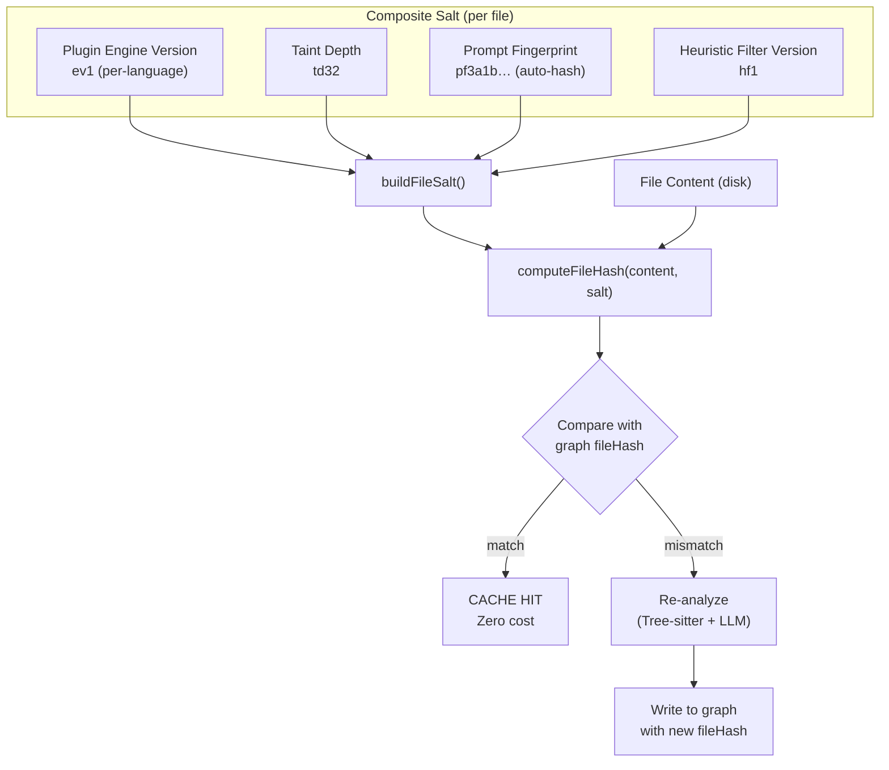

# Incremental Cache Versioning: Engine-Versioned Merkle Tree

> **Status**: The composite per-engine salt design below (`ev:td:pf:hf`) is **not implemented**. There is no `engine-fingerprint.ts`, no `LanguagePlugin.engineVersion`, no `HEURISTIC_FILTER_VERSION`, and no prompt-fingerprint hashing wired into the Merkle salt. The real salt today is just the bare `--taint-depth` value (see [Current Behavior](#current-behavior) below); the structural-plugin Merkle path uses no salt at all. Treat everything under "Architecture" through "First Run After Upgrade" as a design proposal, not shipped behavior.

## Problem Statement

CodeRadius uses a Merkle tree to skip unchanged files during incremental ingestion. Each file's hash is stored in the graph database (via `SourceFile.fileHash`). On re-run, if the hash matches, the file is skipped entirely (no parsing, no LLM call, no graph mutation).

**The fundamental tension**: a file's "identity" in the cache must encode not only *what* the file contains, but *how* it will be analyzed. When we release CLI version `0.10.26` that fixes a PHP detection bug, the user's PHP files haven't changed on disk, but the *extraction logic* has. If the cache identity only tracks file content, the user will never benefit from the bugfix without a destructive `--force` scan that re-analyzes everything, including the 85% of files in other languages that don't need it.

### Industry Landscape

| Tool | Cache Invalidation Strategy | Granularity |
|:--|:--|:--|
| **Semgrep** | CI cache key includes hash of `semgrep.yml` config. Rule change → full invalidation. | None (all-or-nothing) |
| **CodeQL** | Internal incremental DB rebuilt when query packs change (semantic versioning). | Per-query-pack |
| **SonarQube** | Quality Profile change or server/plugin upgrade → full cache invalidation. | None (all-or-nothing) |
| **CodeRadius** | **Per-language, per-engine composite salt** *(proposed, not yet implemented. See status note above)* | Per-file, per-language |

CodeRadius's design goal is **surgical cache invalidation**: a PHP engine bugfix invalidating only `.php` files while TypeScript, Go, and Python files remain cached at zero cost. That granularity does not exist yet. See [Current Behavior](#current-behavior).

---

## Current Behavior

The Merkle salt actually passed to `computeFileHash()` today is a single value, not a composite:

- **Code pipeline** (`src/ingestion/processors/code-pipeline/file-discovery.ts`): `computeFileHash(filePath, taintDepth?.toString() || '8')` uses the `--taint-depth` number as a string for the salt. Changing `--taint-depth` invalidates every code-analysis file hash; nothing else does.
- **Structural plugins** (`src/ingestion/structural/plugin-manager.ts`): `computeFileHash(fp)` is called with **no salt at all**. A language-plugin, prompt, or heuristic-filter change today invalidates neither path; only a `--force` run or a taint-depth change moves the code-pipeline cache.

This is a real, currently-undocumented asymmetry: the code-pipeline Merkle path is sensitive to `--taint-depth`, while the structural-plugin path is sensitive to nothing but file content.

---

## Architecture (Proposed, Not Implemented)

### Composite Salt Design

The Merkle hash for each file is computed as:

```
fileHash = SHA256(compositeSalt + ":" + fileContent)
```

The `compositeSalt` is a deterministic fingerprint that captures the full "execution context" of the analysis pipeline:

```
ev{engineVersion}:td{taintDepth}:pf{promptFingerprint}:hf{heuristicFilterVersion}
```

| Component | Symbol | Scope | Source |
|:--|:--|:--|:--|
| **Engine Version** | `ev` | Per-language | `LanguagePlugin.engineVersion` bumped manually when AST extraction logic changes |
| **Taint Depth** | `td` | Global | CLI `--taint-depth` flag (default: 32) |
| **Prompt Fingerprint** | `pf` | Per-depth | Auto-computed `SHA256(promptInstructions)[0:8]` changes when LLM prompt text changes |
| **Heuristic Filter Version** | `hf` | Global | `HEURISTIC_FILTER_VERSION` constant bumped when a gate is added/removed, when a convention class-suffix or verb whitelist is edited, or when the ORM-metadata recognition changes |

### Data Flow



### Key Files

| File | Responsibility |
|:--|:--|
| `src/ingestion/core/engine-fingerprint.ts` | `buildFileSalt()` computes the composite salt for a given file path |
| `src/ingestion/core/languages/types.ts` | `LanguagePlugin.engineVersion` interface contract |
| `src/ingestion/core/languages/{typescript,php,python,go}.ts` | Per-language engine version values |
| `src/ingestion/processors/code-pipeline/file-discovery.ts` | Consumes the composite salt when computing file hashes |
| `src/ingestion/core/merkle.ts` | `computeFileHash(filePath, salt)` for SHA256 with salt |
| `src/graph/mutations/merkle.ts` | `mergeSourceFile()` persists `fileHash` to the graph |

---

## Invalidation Scenarios

### Scenario 1: Language Plugin Bugfix (Targeted)

**Example**: PHP ORM detection improved in `0.10.26`.

**Action**: Bump `PHPPlugin.engineVersion` from `1` to `2`.

**Effect**:
- Salt for `.php` files changes from `ev1:td32:pf3a1b:hf1` to `ev2:td32:pf3a1b:hf1`
- All `.php` file hashes change → re-analyzed
- `.ts`, `.go`, `.py` file hashes are unchanged → **cache hit** (zero cost)

**Cost**: Proportional to the fraction of PHP files in the repository (roughly 10-20% typically).

### Scenario 2: LLM Prompt Improvement (Global)

**Example**: Added a new anti-hallucination rule to the LLM prompt template.

**Action**: No manual action needed. The prompt fingerprint (`pf`) is auto-computed from the instruction text.

**Effect**:
- Prompt fingerprint changes (e.g., `pf3a1b` → `pf7c9e`)
- **All** file hashes change, triggering full re-ingestion

**Cost**: Full re-ingestion (unavoidable since a different prompt may produce different results for any file).

### Scenario 3: New Heuristic Filter Gate (Global)

**Example**: Added a new gate for gRPC pattern detection.

**Action**: Bump `HEURISTIC_FILTER_VERSION` from `1` to `2`.

**Effect**:
- All file hashes change → full re-ingestion
- Functions previously discarded by the filter may now pass and reach the LLM

**Cost**: Full re-ingestion (necessary since filter changes affect which functions are analyzed).

### Scenario 4: CLI Upgrade, No Logic Changes

**Example**: Version `0.10.27` only fixes a CLI flag parsing bug. No extraction logic, prompt, or filter changes.

**Action**: None needed. All salt components are unchanged.

**Effect**: All file hashes match → **100% cache hit**. Zero LLM calls.

### Scenario 5: Forced Re-analysis (Operational)

**Example**: A user discovers stale data from a pre-bugfix ingestion and wants to force a full re-analysis regardless of cache state.

**Action**: `cr analyze code --force`

**Effect**:
- All caches (Merkle, Scout, Extractor) are bypassed for this run, guaranteeing a cache miss for every file
- Every file is re-analyzed and re-written with the current composite salt
- The next regular run (without the flag) uses the standard incremental cache again

---

## Developer Workflow: When to Bump

### `LanguagePlugin.engineVersion`

Bump when you modify ANY of these methods in a language plugin:

| Method | Why |
|:--|:--|
| `extractFunctions()` | Chunk boundaries change → different function IDs |
| `extractStaticInfra()` | New ORM/framework patterns detected statically |
| `extractImports()` | Import graph resolution changes → taint propagation affected |
| `hasServiceCallsInRange()` | Gate 2.5 filter logic changed → different LLM send decisions |
| `extractClassPropertyAliases()` | DI alias mapping changes → Gate 3 behavior changes |
| `validateInboundPath()` | Sanitizer path validation changes → different post-LLM output |
| `extractValueFacts()` / `extractCriticalInvocations()` | Value resolution changes → static bypass decisions affected |
| `extractFrameworkSignals()` | Decorator/annotation detection changes → overlay edges affected |

**Do NOT bump for**:
- `promptHints()` changes (covered by the auto-computed prompt fingerprint)
- Cosmetic refactoring that produces identical output
- Changes to `extractDependencies()` (manifest-only, not in the Merkle tree path)

### `HEURISTIC_FILTER_VERSION`

Bump when you modify `src/ingestion/core/heuristic-filter.ts`:
- Adding/removing a gate, or changing gate ordering
- Editing the verb whitelists (`REPOSITORY_VERB_REGEX`, `PROCESS_RUNNER_VERB_REGEX`, `PUBLISHER_VERB_REGEX`)
- Editing the class-suffix patterns (Repository/Repo/Dao/Store, Runner/Spawner/Executor/Scraper, Emitter/Publisher/Producer/Dispatcher)
- Changing the ORM-metadata recognition (`LanguagePlugin.recognizesOrmMetadataChunk()`, consulted from Gate 3 in `heuristic-filter.ts`)
- Editing the observability alias blocklist (`OBSERVABILITY_ALIAS_SUFFIXES`)

### Prompt Fingerprint (Automatic)

No manual action needed. The fingerprint is computed at runtime from:
```typescript
hashContent(buildAnalyzerInstructions('fast')).substring(0, 8)
hashContent(buildAnalyzerInstructions('deep')).substring(0, 8)
```

Any change to the prompt constants in `src/ai/agents/unified-analyzer.ts` automatically invalidates the cache.

---

## First Run After Upgrade (Breaking Change)

The first time a user runs a CLI version with the composite salt, the `repoHash` stored in the graph will not match the newly computed hash (because the salt format changed). This triggers a **one-time full re-ingestion**.

This is the expected and correct behavior:
1. The user gets the benefit of all engine improvements accumulated since their last scan
2. Subsequent runs will use the new composite salt and benefit from surgical invalidation
3. The one-time cost is documented in the release notes

**Telemetry**: The trace log distinguishes this case with `reason: 'engine-version-or-file-change'` to help maintainers identify upgrade-triggered re-ingestions vs. actual code changes.

---

## CLI Reference

| Flag | Effect |
|:--|:--|
| `--force` | Bypasses all caches (Merkle, Scout, Extractor) and re-analyzes everything from scratch. |
| `--taint-depth <n>` | Adjusts taint propagation depth (default 32). Today this IS the entire Merkle salt for the code pipeline (see [Current Behavior](#current-behavior)). It would become the `td` component if the composite-salt proposal above ships. |

---

## Further Reading

- [Ingestion Pipeline](./ingestion-pipeline.md): Full pipeline architecture from source resolution to graph persistence
- [Graph Database Optimizations](./graph-database-optimizations.md): Merkle index storage and temporal graph queries
- [Contrib Plugin System](./contrib-plugins.md): Structural plugins (outside the Merkle tree path)
