# CodeRadius Code Ingestion Pipeline

The ingestion pipeline transforms a repository into a Knowledge Graph in a graph database (like Memgraph). It is designed to be fast, deterministic, and cost-effective by filtering out as much noise as possible *before* invoking any LLM.

---

## Overview: Pipeline Diagram

```mermaid
flowchart TD
    A([Repository / Path]) --> B[Source Resolver]
    B --> C[Auto-Discovery]
    C --> D["Scope Manager<br/>.gitignore / .crignore / exclusions"]

    D --> STRUCT["Structural Plugins<br/>Dockerfile · Makefile · tsconfig.json"]
    STRUCT --> RECON["Reconciliation<br/>mark-and-sweep stale entities"]
    RECON --> G_STRUCT[("Graph<br/>DockerImage · Task · ToolConfig · ProjectDirectory")]

    D --> PASS1

    subgraph SA["🔍 Static Analysis Engine"]
        PASS1["Pass 1 – Tree-sitter Parse<br/>Chunks + Import Maps + DI Aliases<br/>+ Framework Signals + File Constants"]
        PASS1 --> MERKLE{"Function-level<br/>Merkle hash<br/>unchanged?"}
        MERKLE -->|yes, unchanged| CACHEHIT[Cache Hit – skip LLM]
        MERKLE -->|no or new| TAINT

        TAINT["Taint Analysis – BFS<br/>Seed Patient Zero files<br/>Propagate up import graph<br/>Map DI aliases this.x → Type"]
        TAINT --> CUSTOM["Load coderadius.yaml<br/>packages.analyze escape hatch"]
        CUSTOM --> PASS2

        PASS2["Pass 2 – Heuristic Filter<br/>likelyHasIOWithTaint (5 architectural gates)"]
        PASS2 --> GATE1{"Gate 1<br/>UseCase entrypoint"}
        GATE1 -->|pass| QUEUE[Queue for LLM]
        GATE1 -->|fail| GATE2{"Gate 2<br/>Repository / Runner /<br/>Publisher convention"}
        GATE2 -->|pass| QUEUE
        GATE2 -->|fail| GATE3{"Gate 3<br/>Synthetic chunk<br/>consumer · ORM metadata"}
        GATE3 -->|pass| QUEUE
        GATE3 -->|fail| GATE4{"Gate 4<br/>Tainted Symbol<br/>in function body?"}
        GATE4 -->|pass| QUEUE
        GATE4 -->|fail| GATE5{"Gate 5<br/>DI Alias<br/>this.api tainted?"}
        GATE5 -->|pass| QUEUE
        GATE5 -->|fail| DISCARD[Discard – no LLM call]

        PASS1 --> FWSIG["Framework Signals<br/>@Controller · @EventPattern<br/>@Entity · custom decorators"]
        FWSIG --> PASS2

        PASS1 --> SCHEMA_GATE{"Schema Gate<br/>mayContainSchemas<br/>interface · struct · .proto · .prisma"}
        SCHEMA_GATE -->|yes| SCHEMA_CTX["SchemaContext<br/>passed to LLM"]
        SCHEMA_GATE -->|no| DISCARD
    end

    QUEUE --> LLM

    subgraph SEM["🧠 Semantic Extraction"]
        LLM["LLM – Gemini / OpenAI / Anthropic<br/>Function source + imports + DI context<br/>+ framework signals + file constants"]
        LLM --> SANITIZER["Post-LLM Sanitizer<br/>Drop hallucinated names<br/>Resolve constants · PascalCase guard"]
        SANITIZER --> OUT["intentSummary<br/>capabilities<br/>embedding"]
    end

    SCHEMA_CTX --> LLM
    OUT --> WRITER["Graph Writer<br/>MERGE Function node<br/>+ emergent edges"]
    WRITER --> G_CODE[("Graph<br/>Function · Datastore · APIEndpoint<br/>MessageChannel · DataStructure · DataField")]

    G_CODE --> POST

    subgraph POST["🌐 Post-Processing"]
        MATCH["Matchmaking<br/>Link emergent endpoints<br/>to canonical APIInterface"]
        RESOLVER["Global Edge Resolver<br/>3-level funnel: exact → regex → LLM"]
        MATCH --> RESOLVER
    end

    RESOLVER --> G_FINAL[('Complete Knowledge Graph')]
    G_STRUCT --> G_FINAL
    CACHEHIT --> G_FINAL
```



---

## 🏗️ 1. Source Resolution & Discovery

**Entrypoints**: `src/ingestion/core/source-resolver.ts`, `src/ingestion/extractors/autodiscovery.ts`

- **Source Resolver**: Clones a remote repository locally or resolves a local path. Maintains a path+branch cache (`ResolvedRepo`).
- **Auto-Discovery**: Scans the directory structure for language-specific manifest files (`package.json`, `go.mod`, `pom.xml`, `composer.json`) to identify service boundaries. Handles monoliths with no manifest by treating the root as a single service.
- **Scope Manager**: Applies `.gitignore`, `.crignore`, and hardcoded exclusion patterns to eliminate noise (test files, vendored code, documentation). Returns a filtered file list for all subsequent stages.

---

## 🧱 2. Structural Extraction

**Entrypoint**: `src/ingestion/structural/plugin-manager.ts`

A set of deterministic, stateless plugins analyze specific file types and write directly to the graph. No LLM involved.

| Plugin | File(s) | Nodes Created |
|--------|---------|---------------|
| `dockerfile.plugin` | `Dockerfile` | `DockerImage` |
| `makefile.plugin` | `Makefile` | `Task` |
| `toolconfig.plugin` | `tsconfig.json` | `ToolConfig` (TypeScript config flags) |
| `package-scripts.plugin` | `package.json`, `composer.json` | `Task` (npm/pnpm/yarn/bun/composer scripts) |
| `simple-tools.plugin` | Lockfiles, linter configs, etc. | `ToolConfig` (package manager + tool presence) |
| `package-publisher.plugin` | `package.json`, `composer.json` | `Release` (publishable package detection) |
| `ciconfig.plugin` | CI config files | `StructuralFile` (presence registration) |
| `gitlabci.plugin` | `.gitlab-ci.yml` | `CIPipeline` (stages, jobs, deploy/test flags) |
| `githubactions.plugin` | `.github/workflows/*.yml` | `CIPipeline` (jobs, deploy/test flags) |
| `renovate.plugin` | `renovate.json`, `.renovaterc` | `ToolConfig` (governance signals) |
| `agentic-config.plugin` | Cursor, Claude, Gemini, etc. | `AgenticConfig` (AI coding configs) |
| `devtools.plugin` | `.devcontainer.json`, catalog YAML | `StructuralFile` (presence registration) |
| `ghost-directories.plugin` | Repository tree scan | `ProjectDirectory` |
| **Contrib Plugins** | | |
| `crossplane-pubsub.plugin` | `.charts/templates/*.yaml` | `MessageChannel` (topic/subscription + `ROUTES_TO` edges) |

#### Package Manager Detection

The `package-scripts.plugin` detects the specific package manager used per `package.json` using a priority chain:

1. **`packageManager` field** (Corepack standard, e.g. `"packageManager": "pnpm@9.15.0"`) has the highest priority
2. **Lockfile walk** checks for lockfiles in the same directory, then walks up to repo root (monorepo support)
3. **Fallback** defaults to `npm`

| Lockfile | Detected Runner |
|----------|----------------|
| `pnpm-lock.yaml` | `pnpm` |
| `yarn.lock` | `yarn` |
| `bun.lock` / `bun.lockb` | `bun` |
| `package-lock.json` | `npm` |

The `simple-tools.plugin` separately emits `ToolConfig` presence nodes for all detected package managers, including Python and Go:

| Lockfile | Tool ID |
|----------|---------|
| `package-lock.json` | `npm` |
| `yarn.lock`, `.yarnrc.yml` | `yarn` |
| `pnpm-lock.yaml`, `pnpm-workspace.yaml` | `pnpm` |
| `bun.lock`, `bun.lockb` | `bun` |
| `composer.lock` | `composer` |
| `Pipfile.lock` | `pipenv` |
| `poetry.lock` | `poetry` |
| `uv.lock` | `uv` |
| `pdm.lock` | `pdm` |
| `go.sum` | `go` |

**Reconciliation** (mark-and-sweep): After every run, stale entities whose source file was deleted are removed from the graph. This keeps the graph in sync with the actual codebase.

---

## 🔍 3. Static Analysis & Taint Engine

**Entrypoint**: `src/ingestion/processors/code-pipeline/static-analyzer.ts`

This is the most sophisticated stage. It uses a **two-pass approach** to decide which functions are worth sending to the LLM, dramatically reducing cost and latency.

### Pass 1: Parse & Import Collection
Every source file is parsed with **Tree-sitter** to extract:
- `CodeChunk` objects (one per function/method)
- Import declarations (used to build the import graph)
- Class property type aliases (used for DI alias detection)
- File constants and safe config-object literals (used to resolve infrastructure names before the LLM)
- **Framework signals**: decorators like `@Controller`, `@EventPattern`, `@Entity`, and custom decorators registered via `coderadius.yaml` (see [Framework Signals](#framework-signals) below)

Files that haven't changed since the last run are skipped via a **function-level Merkle hash** stored in the graph. Even for cache hits, import metadata is recovered to correctly reconstruct the taint graph on subsequent runs.

### Incremental Cache Versioning

The Merkle salt today is not a composite. It's a single value. The code-pipeline path computes `fileHash = SHA256(taintDepth.toString() + ":" + fileContent)`, so the only thing that currently invalidates a code-analysis file hash (besides the file's own content) is a `--taint-depth` change. The structural-plugin Merkle path hashes with no salt at all. A per-language `engineVersion` / prompt-fingerprint / heuristic-filter-version composite salt is a proposed design, not yet implemented.

> For the full picture, including the proposed composite-salt design, why it doesn't exist yet, and the real current behavior, see [Incremental Cache Versioning](./incremental-cache-versioning.md).

### Value Resolution Engine & File Constants

Before a function reaches the LLM, CodeRadius runs a deterministic **Value Resolution Engine** (`src/ingestion/core/value-resolution`). This engine traces the lineage of expressions used in critical I/O invocations (e.g., database queries, message publishers, HTTP requests) to discover concrete infrastructure names that would otherwise be hidden behind variable assignments, environment lookups, or configuration indirection.

#### Cross-File Resolution & Static Triage

The Value Resolution Engine follows the import chain across files (up to a depth of 8 hops) to resolve aliases, default values, and environment variables. When a function references `this.busConfig.topicSave`, the resolver traces it to the imported configuration file and resolves its exact value or fallback string.

- **Fully Resolved**: If an expression is resolved with high confidence (≥ 0.9), the system generates a static architectural analysis (`isResolvedStatically: true`) and **skips the LLM entirely**.
- **Partially Resolved**: If the expression depends on dynamic environment variables but still provides valuable context, the resolved trace is injected into the LLM prompt as a `resolvedInvocationContext` block (e.g., `ORDERS_TOPIC_SAVE -> "order-save"`). This dramatically improves LLM extraction accuracy.

#### Supported Resolution Patterns

| Pattern | Example | Resolution |
|---------|---------|------------|
| Top-level `const` / literals | `const TOPIC = 'order.created'` | Resolved statically |
| Schema Defaults | `z.string().default('order.save')` | Fallback value |
| Env fallbacks | `os.getenv('TOPIC', 'fallback')` | EnvKey + Fallback |
| Polyglot Assignments | Go `const`, PHP `class const`, Py `self.x` | Resolved statically |

*(Note: The legacy file constants mapping is still maintained as a fail-safe for the post-LLM sanitizer and covers specific cases like NestJS `registerAs` factory patterns.)*

### Taint Analysis: BFS Import Graph Propagation

**Core idea**: If a file imports from a known I/O library (e.g. `axios`, `pg`, `amqplib`), it's marked as "tainted". Any file that *imports from that tainted file* also becomes tainted, up to a configurable depth (default: 32 hops).

**Algorithm:**
1. **Seeding ("Patient Zero")**: Any file that directly imports a known I/O sink is tainted. The registry of known sinks (`KNOWN_IO_SINKS` in `import-graph.ts`) covers >70 libraries across HTTP, databases, queues, cloud SDKs, etc.
2. **BFS Propagation**: The taint spreads *up* the reverse import graph. If `user-service.ts` imports `CustomHttpClient.ts`, and `CustomHttpClient.ts` imports `axios`, then `user-service.ts` is also tainted. The default propagation depth is 32 levels, which can be configured via the `--taint-depth <n>` CLI flag to optimize precision and performance.
3. **DI Alias Mapping**: For classes that inject dependencies via constructors (e.g. `constructor(private api: ApiGateway)`), the system maps `this.api → ApiGateway`. If `ApiGateway` is tainted, any method using `this.api` is also flagged, even without a direct import.

**Escape Hatch** (`coderadius.yaml`): If your codebase uses a custom I/O wrapper not in the built-in registry, you can teach the taint engine about it:
```yaml
# coderadius.yaml (repo root)
packages:
  analyze:
    - "@acme-corp/internal-http"
    - "mycompany/kafka-client"
```

The same file also supports `packages.ignore` (remove false-positive sinks), `hints` (inject LLM prompt instructions for proprietary SDKs), and `databases` (declare physical database identity for shared-DB architectures). See the full [coderadius.yaml Reference](../guide/coderadius-yaml.md).

### Framework Signals

**Entrypoint**: `src/ingestion/core/languages/typescript/framework-signals.ts`

During Pass 1, the AST is also scanned for **framework decorators** that carry architectural semantics. These signals are extracted deterministically (zero LLM) and serve two purposes:

1. **Overlay injection**: Framework signals inject infrastructure edges directly into the LLM output (e.g., an `@Get('/users')` decorator adds an `APIEndpoint` without relying on the LLM to discover it)
2. **Consumer rescue**: When a class has a consumer decorator but tree-sitter produces 0 method chunks (thin wrapper classes), a synthetic `__consumer_entrypoint` chunk is injected (see Gate 3 below)

| Signal Kind | Detected From | Example |
|-------------|---------------|---------|
| `http-handler` | `@Get`, `@Post`, `@Controller` | NestJS REST endpoints |
| `message-consumer` | `@EventPattern`, `@MessagePattern`, custom decorators | Message broker consumers |
| `message-processor` | `@Processor` | Bull/BullMQ job processors |
| `orm-entity` | `@Entity`, `@Table`, `@Collection` | TypeORM/Mongoose entities |
| `graphql-operation` | `@Query`, `@Mutation`, `@Resolver` | GraphQL resolvers |
| `cron-job` | `@Cron`, `@Interval` | NestJS schedule decorators |

**Custom decorators** can be registered via `coderadius.yaml`:
```yaml
decorators:
  - name: EventConsumer
    args: [routingKey, queue]
    kind: message-consumer
```

### Consumer Rescue Mechanism

**Entrypoint**: `src/ingestion/core/languages/typescript/chunk-extraction.ts`

Some consumer classes are so thin (one-line `handleEvent` body) that tree-sitter produces 0 function chunks. Without intervention, these files silently drop to "0 found" in the pipeline.

The **consumer rescue** detects this case:
- If `chunks.length === 0` AND framework signals include a class-level `message-consumer` signal
- A synthetic full-file chunk named `ClassName::__consumer_entrypoint` is injected
- Gate 3 in the heuristic filter auto-passes this chunk (see below)

### Pass 2: Heuristic Filter (5 architectural gates)

**Entrypoint**: `src/ingestion/core/heuristic-filter.ts`

For each function in a tainted file, `likelyHasIOWithTaint()` decides whether to send it to the LLM. Gates are evaluated in numbered order. If any passes, the function is queued for LLM analysis:

| Gate | Description | Requires Taint Data |
|------|-------------|--------------------|
| **Gate 1: UseCase** | Matches application-layer entrypoints by filepath (`/application/`, `/usecases/`, `*.usecase.ts`) AND method (`handle`, `execute`, `run`). | No |
| **Gate 2: Architectural Convention** | Class-suffix + verb whitelist. Three families: <br>• `*Repository\|*Repo\|*Dao\|*Store` + CRUD/cache/SQL-builder verbs<br>• `*Runner\|*Spawner\|*Executor\|*Scraper` + `spawn\|exec\|run\|invoke\|launch\|fork\|start`<br>• `*Emitter\|*Publisher\|*Producer\|*Dispatcher` + `emit\|publish\|produce\|send\|dispatch\|enqueue\|broadcast\|notify`<br>Anonymous arrow-fields inside any of these classes inherit the class signal via `chunk.parentClassName`. | No |
| **Gate 3: Synthetic Chunks** | Auto-passes plugin-emitted chunks: `__consumer_entrypoint`, `__server_action`, and `__class_metadata` (ORM entity declarations: Doctrine annotations, PHP 8 attributes, Eloquent `Model`, Mongoose `$collection`). | No |
| **Gate 4: Tainted Symbols** | Word-boundary match: function body references a symbol name in the file's `taintedSymbols` set (seeded from imports that resolve to a sink package). Followed by a Gate-4 AST verification override that drops chunks containing the tainted name only inside type annotations or parameter lists (no actual call expression). | Yes |
| **Gate 5: DI Aliases** | Substring match in stripped-comment source: function uses `this.xxx` where `xxx` is a constructor-param property whose type or `@Inject('TOKEN')` decorator value is tainted. Observability aliases (`this.logger`, `this.tracer`, `this.metrics`, ...) are explicitly blocklisted. | Yes |

> Functions that pass *none* of these gates are **silently discarded**, saving an LLM call. Architectural conventions (1, 2, 3) run before taint lookups (4, 5) so a Repository method like `OrderRepository.findById` short-circuits without scanning every tainted symbol.
>
> A **Gate 6: Framework / Supplemental** catch-all is applied by the static-analyzer task builder (not by `likelyHasIOWithTaint` itself): chunks that fail Gates 1-5 still pass if the static analyzer attached `resolvedInvocationContext`, plugin-extracted `resourceDeclarations` / `clientBindings`, or matched a framework-decorator hard-entrypoint capability (`@Controller`/`@Post`/`@MessagePattern`/`@Cron`/...). These land in the LLM queue with `filterGate=6` and a `supplemental:*` or `gate6:framework-entrypoint` reason.

### Schema Gate (parallel path)

In parallel with the IO filter, `mayContainSchemas()` inspects the AST to check if a file defines data structures (TypeScript `interface`/`type`, Go `struct`, PHP classes, `.proto`, `.prisma`, `.graphql`, `.sql`). Files that pass the Schema Gate are included in the `SchemaContext` passed to the LLM for `DataStructure` / `DataField` extraction.

---

## 🧠 4. Semantic Extraction (LLM)

**Entrypoint**: `src/ai/workflows/semantic-extraction.ts`

Functions that passed the Static Analysis stage are sent to the configured LLM in batches. The LLM receives:
- The function source code
- Its import statements (for DI context)
- The class constructor source (if it's a method)
- The list of DI aliases (`this.api: ApiGateway`)
- **Resolved file constants** (e.g., `this.busConfig.busTopicSave = "OrderShipping-Save"`)
- **Framework signal context** (e.g., `@EventPattern('order.created')` metadata)
- **Custom knowledge** (from `coderadius.yaml` `hints` section)

The LLM returns a structured `UnifiedAnalysis` object:
- `intent`: a one-sentence semantic description of what the function does
- `infrastructure[]`: discovered I/O targets with name, type, and operation (`READS`/`WRITES`)
- `capabilities[]`: high-level capability tags
- `produced_payloads` / `consumed_payloads`: data contract fields
- `emergent_api_calls[]`: outbound HTTP calls with method and path

### Post-LLM Sanitizer

**Entrypoint**: `src/ai/workflows/sanitizer.ts`

Before writing to the graph, the LLM output passes through a **deterministic sanitizer** (zero LLM calls, <1ms) that catches common hallucination patterns:

| Filter | What It Catches |
|--------|-----------------|
| **Generic infra names** | `mongodb`, `postgres`, `redis`, `prisma` (technology names, not resource names) |
| **Noisy broker names** | `queue`, `exchange`, `bus`, `outbox`, `<DYNAMIC>` (generic concepts) |
| **PascalCase guard** | Pure PascalCase names ≥7 chars without separators (`.`, `-`, `_`) (always class/event names, never physical channels) |
| **Class suffix** | Names ending in `Client`, `Service`, `Repository`, `UseCase`, `Consumer`, etc. |
| **Template variables** | Unresolved `{ENV}`, `${VAR}` patterns in names |
| **Property-access resolution** | `busConfig.busTopicSave` → resolves to `OrderEngine-Save` using the file constants map |
| **Hallucinated table guard** | Table names not present in the source code |

**Graph Writer** (`graph-writer.ts`) then merges the `Function` node and all sanitized connections (links to `Datastore`, `APIEndpoint`, `MessageChannel`, etc.) into the graph.

> **Performance**: The function-level Merkle hash ensures that if `myFunc` didn't change since the last run, it is never re-sent to the LLM. Only *changed* functions are processed.

---

## 🌐 5. Post-Processing & Refinement

**Entrypoints**: `src/ingestion/processors/global-resolver.ts`, `processors/matchmaking.ts`

After all code has been analyzed, two final phases clean up loose edges:

### Matchmaking / OpenAPI
OpenAPI spec files (`openapi.yaml`/`.json` in the repo) declare canonical API interfaces. The matchmaker links emergent `APIEndpoint` nodes (discovered by the LLM/static analysis from code) to the canonical `APIInterface` defined in the spec. (Backstage `catalog-info.yaml` `providesApis`/`consumesApis` declarations are a separate, currently-unrelated signal. See [Catalog Drift & Grounding](./catalog-drift-grounding.md).)

### Global Edge Resolver
Connects emergent endpoints discovered in one service to functions in *other* services that call them. This produces cross-service impact analysis: "If I change endpoint X in Service A, which functions in Services B and C are affected?"

Uses a 3-level funnel:
1. **Exact match**: `GET /users/{id}` ↔ `GET /users/{id}`
2. **Template regex**: normalizes path params before matching
3. **LLM fallback** (only with `--depth contracts`): semantic embedding similarity

---

## 🛡️ 6. Vulnerability Enrichment (Optional)

**Entrypoint**: `src/ingestion/enrichment/vulnerability-enricher.ts`

An optional post-ingestion step that cross-references extracted package dependencies against the OSV.dev public vulnerability database. Runs after the dependency graph is built (lockfile extraction) and before post-processing.

### Data Flow

```
Package nodes (from lockfile-extractor.ts)
  → Read all non-internal packages with installed versions from graph
  → Partition: cache hits vs. cache misses (per-item, 24h TTL)
  → POST cache misses to api.osv.dev/v1/querybatch (chunked at 1000)
  → Parse response: extract severity, fix versions, affected ranges
  → MERGE Vulnerability nodes (cr:vulnerability:{osvId})
  → MERGE (Package)-[:HAS_VULNERABILITY]->(Vulnerability) edges
      with vulnerableInstalledVersions[] for version-aware filtering
```

### Key Design Decisions

- **Vulnerability node has no bitemporality**: a CVE is a global, immutable fact. `valid_from_commit` / `valid_to_commit` lives on the `HAS_VULNERABILITY` edge only.
- **`vulnerableInstalledVersions` on the edge**: Package is an abstract node ("lodash", not "lodash@4.17.20"). Without this field, all consumers of the abstract Package would be flagged, including services that already patched. The enricher stores which exact installed versions triggered the CVE, enabling precise Cypher filtering: `dep.installedVersion IN hv.vulnerableInstalledVersions`.
- **Per-item cache**: a single version bump in a 1200-dep monorepo invalidates only that entry, not the entire cache.
- **Privacy**: only `(ecosystem, name, version)` tuples of public packages leave the machine. Source code, file paths, and repo metadata never leave.
- **Grounding**: `source: 'infra'`, `quality: 'high'`, `extractor: 'osv-enrichment@v1'`.

### Module Structure

```
src/ingestion/enrichment/
    index.ts                   - barrel + feature gate
    osv-client.ts              - OSV.dev batch API client (chunked, retry, privacy contract)
    vulnerability-enricher.ts  - orchestrator: graph read → OSV call → graph write
    ecosystem-map.ts           - CodeRadius→OSV ecosystem mapping
    vuln-cache.ts              - per-item file-based JSON cache with TTL
```

---

## 📊 Graph Schema Context

The structure of the graph is centrally defined in `src/graph/domain.ts`, the single source of truth for node labels, Zod schemas, and constraints.

- **DB Constraints** → derived from `CONSTRAINT_MAP`
- **AI Agent Schema** → `GRAPH_SCHEMA` in `schema.ts` dynamically extracts property names from Zod schemas
- **MCP Resource Labels** → `RESOURCE_LABELS` subset consumed by the AI tooling layer

Any new node type requires a single addition to `domain.ts`. Constraints, the AI agent prompt, and the MCP tool all update automatically.

### Further Reading
- [Incremental Cache Versioning](./incremental-cache-versioning.md): Deep-dive on the Engine-Versioned Merkle Tree, composite salt design, invalidation scenarios, developer workflow for engine version bumps, and operational flags (`--force`, `--taint-depth`).
- [Graph Database Optimizations](./graph-database-optimizations.md): Details on the O(1) traversal topology (e.g. `Repository -[:CONTAINS]-> SourceFile`) and Temporal Graph query rules.
- [Contrib Plugin System](./contrib-plugins.md): Architecture for domain-specific structural plugins (Crossplane PubSub, Terraform, etc.) and the `StructuralEntity.edges` contract.
- [coderadius.yaml Reference](../guide/coderadius-yaml.md): Full reference for all per-repo configuration options: `packages`, `decorators`, `databases`, `hints`.
