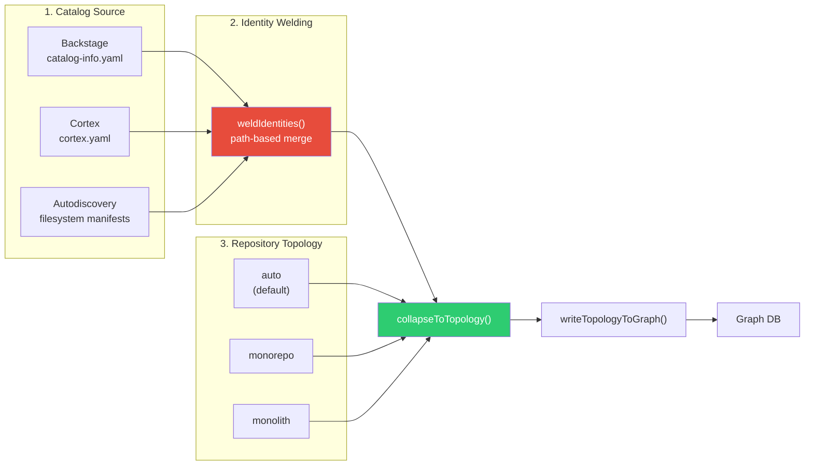
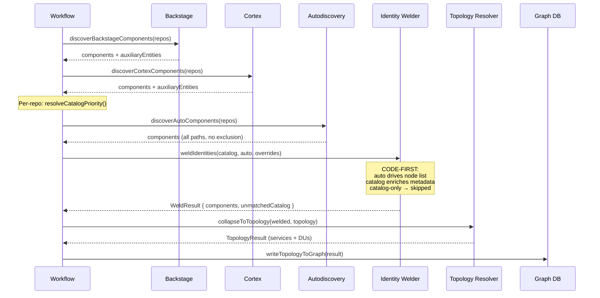
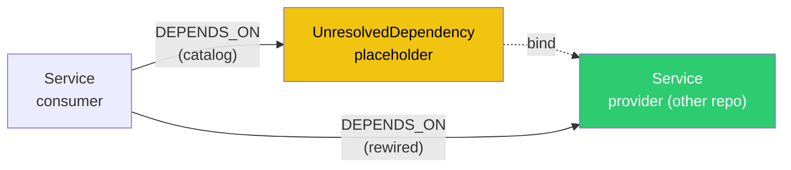

# Service Topology Architecture

> Internal reference for the CodeRadius ingestion pipeline.

## Core Principle: Code Is Truth

CodeRadius uses a **code-first identity model**:

- **Autodiscovery (filesystem manifests)** decides **WHAT services exist**
- **Catalog sources (Backstage, Cortex)** decide **WHO owns them** and **how they relate**
- Neither source alone has the complete picture. The topology resolver welds them together.



---

## The Identity Problem

Catalog sources (Backstage, Cortex) provide **rich metadata** (owner, system, dependencies) but often use **administrative names**:
```
com.acme.eng.inventory.core.api   ← nobody calls the service this
```

Autodiscovery provides **technical identity** (directory name, language) but has **no metadata**:
```
api/   ← this is what the team calls it
```

**Code is the source of truth for topology.** Catalog is the source of truth for governance metadata. The topology resolver welds them together.

---

## Pipeline Flow



---

## Identity Welding (Code-First)

### How It Works

Autodiscovery components are the **primary list**. For each autodiscovery component, the welder looks for a catalog component in the **same directory** and merges its metadata:

```
Autodiscovery: /repo/api/composer.json     → "api"        (code exists: Yes)
Backstage:     /repo/api/catalog-info.yaml → "com.acme..." (metadata enrichment)
```

Both point to `/repo/api/`. The welder merges them:

| Field | Source | Example |
|-------|--------|---------|
| `name` | Directory basename (auto) | `api` |
| `catalogName` | Original catalog name | `com.acme.eng.inventory.core.api` |
| `catalogSource` | Catalog type | `backstage` |
| `owner` | Catalog | `team-platform` |
| `system` | Catalog | `inventory` |
| `dependsOn` | Catalog | `['external-svc']` |
| `language` | Autodiscovery (wins) | `php` |
| `description` | Catalog | `REST API for orders` |

### What Happens to Catalog-Only Components

Catalog components that have **no matching autodiscovery component** (no code in that directory) are **NOT** promoted to Service nodes. They are collected in `unmatchedCatalogComponents` for observability and logged as warnings.

This prevents **phantom nodes** (Service entries in the graph that have no code, no functions, and no language, created solely because a catalog-info.yaml mentioned them).

### Safety Net (Legacy Repos)

CodeRadius implements a **Per-Directory Safety Net** to handle mixed monorepos (e.g., a modern React frontend alongside a legacy Ant-build Java backend and some bash scripts).

If a catalog component's directory has **zero autodiscovery coverage** (meaning no code manifests were found in that specific directory tree):

- The primary catalog component for that directory is promoted to a Service as a fallback
- A `WARN` log is emitted advising the user to add manifest files
- This prevents silent data loss for legacy services while still dropping purely orphaned catalog entries in covered directories

### Multi-Document YAML

A single `catalog-info.yaml` can declare multiple entities (`---` separator). When welding:

- **Only the primary component** for that directory is welded with the autodiscovery identity
- Primary selection: name matches repo name, then `type: service` > `type: library`, then shallowest path, then alphabetical
- **Secondary components** are NOT promoted to Services (they go to unmatched)

### Generic Directory Names (Parent-Walk)

When the directory basename is generic, the algorithm **walks UP** the directory tree to find the nearest non-generic ancestor:

```
Blacklisted: src, app, backend, frontend, main, server, client, lib, core, 
             common, shared, pkg, cmd, internal, web, service, services, application
```

Examples:

| Path | Walk | Result |
|------|------|--------|
| `/repo/order-service/src` | `src` (no) → `order-service` (yes) | `order-service` |
| `/repo/payment-service/src` | `src` (no) → `payment-service` (yes) | `payment-service` |
| `/repo/checkout/src/main` | `main` (no) → `src` (no) → `checkout` (yes) | `checkout` |
| `/repo/src/app` | `app` (no) → `src` (no) → root | `my-repo` (fallback) |
| `/repo/api` | `api` (yes) | `api` |

This prevents name collisions in multi-service repos where each service nests its code inside a generic `src/` directory.

### Name Override (Edge Cases Only)

```yaml
# .coderadius.yaml: for rare cases where auto-welding isn't enough
services:
  nameOverrides:
    "com.acme.eng.shop.platform.acme-platform": "acme-platform-app"
```

---

## Graph Node

```
(:Service {
    id: "cr:service:org/acme-platform:api",                         // Clean URN
    name: "api",                                             // Useful name
    catalogName: "com.acme.eng.inventory.core.api",    // Traceability
    catalogSource: "backstage",                              // Metadata provenance
    language: "php",
    description: "REST API for orders"
})
```

---

## Catalog Sources

| Source | File | Key fields | Status |
|--------|------|------------|--------|
| **Backstage** | `catalog-info.yaml` | `metadata.name`, `spec.owner`, `spec.system`, `spec.dependsOn` | Yes (Production) |
| **Cortex** | `cortex.yaml` | `x-cortex-tag`, `x-cortex-owners`, `x-cortex-dependencies` | Yes (Implemented) |
| **Autodiscovery** | Filesystem manifests | Inferred from directory + language | Yes (Production) |

### Catalog Source Field Mapping

| Concept | Backstage | Cortex | `DiscoveredComponent` |
|---------|-----------|--------|-----------------------|
| Service ID | `metadata.name` | `x-cortex-tag` | `name` (pre-welding) |
| Display name | `metadata.name` | `info.title` | `title` |
| Description | `metadata.description` | `info.description` | `description` |
| Owner | `spec.owner` | `x-cortex-owners[0].name` | `owner` |
| System | `spec.system` | `x-cortex-parents[0].tag` | `system` |
| Dependencies | `spec.dependsOn[]` | `x-cortex-dependencies[].tag` | `dependsOn[]` |
| Type | `spec.type` | `x-cortex-type` | `type` |
| Language | annotation | `x-cortex-custom-metadata.language` | `language` |

---

## Repository Topology

| Value | Meaning | Config |
|-------|---------|--------|
| `auto` (default) | Heuristic: same-dir catalog components → monolith; otherwise → monorepo | No config needed |
| `monorepo` | Each component → independent Service node | Explicit override |
| `monolith` | Primary component → Service, rest → DeploymentUnit | Explicit override |

### Auto-Topology Heuristic

The `auto` topology uses two rules to determine the structure:

1. **Smart Monolith (Code-first)**: If the repository contains exactly *one* autodiscovery root (i.e. it builds as a single codebase), and there is at least one catalog component, and ALL catalog components are physically nested inside the autodiscovery root's directory, treat it as a **monolith**. The scattered catalog components are considered logical facets (Deployment Units).
2. **Directory Overlap (Catalog-first)**: If rule 1 doesn't apply (e.g. true monorepos), but *all* catalog-sourced components share the exact same `catalog-info.yaml` directory, treat the repository as a **monolith** (this targets the multi-document YAML pattern). Otherwise, treat it as a **monorepo**.

| Scenario | Detection | Result |
|----------|-----------|--------|
| `/repo/composer.json` + catalog components scattered inside `/repo/classes/` and `/repo/src/` | Smart Monolith (Rule 1) | **monolith** (1 Service + N DUs) |
| `/repo/frontend/package.json` + `/repo/backend/catalog-info.yaml` | Sibling paths, neither nested | **monorepo** (2 Services) |
| `/repo/catalog-info.yaml` with 2 Components | Directory Overlap (Rule 2) | **monolith** (1 Service + 1 DU) |
| `/repo/api/catalog-info.yaml` + `/repo/worker/catalog-info.yaml` (No auto root) | Different dirs | **monorepo** (2 Services) |
| Only autodiscovery (no catalog) | No catalog signal | **monorepo** |

Pure autodiscovery components are ignored by the heuristic. Only Backstage/Cortex components carry the multi-doc YAML semantic.

The explicit `topology: monorepo` or `topology: monolith` overrides in `.coderadius.yaml` always win over auto-detection.

### Monorepo

```
catalog-info.yaml ×3 in different dirs → 3 independent Service nodes
                                        (each with own team, deps, code ownership)
```

### Monolith

```
catalog-info.yaml ×3 in same dir → 1 Service node (primary)
                                 + 2 DeploymentUnit nodes (facets)
                                   Dependencies classified:
                                     - intra-repo → Package (internal ecosystem)
                                     - external → Service stub
```

### Primary Component Selection

1. Component name matches repo name → **primary**
2. `type: service` preferred over `type: library`
3. Shallowest `catalog-info.yaml` path → primary
4. Alphabetical tie-breaker for determinism

---

## Cross-Repo Dependency Resolution

`dependsOn` entries in catalog sources reference services that may live in
**other** repositories. Naïvely creating a `:Service` stub per dep leaks
phantom nodes that never reconcile when the real repo is later ingested.
Resolution happens in three deterministic steps instead.



### Step 1: Eager intra-repo bind

In `writeTopologyToGraph`, deps whose normalized name matches a Service
**in the same repo** (by `name` or `catalogName`) become direct
`DEPENDS_ON` edges to the local Service. This catches the common case where
a catalog declares `dependsOn: component:default/com.acme.api` and the
local welded Service is named `api`. The eager path resolves it without
ever creating a placeholder.

### Step 2: Lazy cross-repo bind

After all repos are ingested, `bindUnresolvedDependencies(commitHash)` runs
once. For every `:UnresolvedDependency` it collects up to two `:Service`
candidates (matched by `s.catalogName = u.name OR s.name = u.name`,
ordered: catalogName first, then `id` ascending), then:

- exactly **one** candidate → rewire all incoming `DEPENDS_ON` edges to
  the candidate, `DETACH DELETE` the placeholder;
- **catalogName-unique among many** → same rewire (deterministic);
- **zero candidates** → the placeholder is unbindable (typically a
  `resource:*` reference materialised by code analysis as a
  `:Datastore`/`:MessageChannel`, not a `:Service`). The placeholder and
  its incoming edges are `DETACH DELETE`d so the graph is not polluted by
  dangling links to a node nothing knows how to resolve;
- **ambiguous** (≥2 candidates, no unique catalogName winner) → leave the
  placeholder; logged for governance.

### Step 3: Garbage collection

`gcOrphanUnresolvedDependencies()` hard-deletes any
`:UnresolvedDependency` with no incoming edge as a defensive sweep (pre-1.0
policy: re-ingesting regenerates them if still referenced).

### Resource references

Backstage `kind: Resource` is filtered upstream by the extractor; physical
infra (`Datastore`, `MessageChannel`, `Cache`) emerges from code analysis
(DB drivers, broker SDKs). `dependsOn: resource:default/mysql` therefore
becomes a transient `:UnresolvedDependency` that finds no `:Service` match
and is GC-removed. Mapping `resource:*` to `:Datastore`/`:MessageChannel`
based on Backstage `spec.type` is a documented follow-up.

---

## Configuration

### `.coderadius.yaml`

```yaml
services:
  topology: monolith    # or: monorepo, auto (default: usually omit this)
  
  # Override auto-derived names (rare: for edge cases only)
  nameOverrides:
    "com.acme.eng.shop.platform.acme-platform": "acme-platform-app"

  # Per-component role overrides
  overrides:
    sidecar-api:
      role: independent-service    # Promote to Service in monolith mode
    legacy-worker:
      role: deployment-facet       # Demote to DeploymentUnit in monorepo mode
```

---

## File Map

| File | Responsibility |
|------|---------------|
| [topology-resolver.ts](../../src/ingestion/topology-resolver.ts) | Interfaces, identity welding, collapse logic, graph writer |
| [backstage-extractor.ts](../../src/ingestion/extractors/backstage-extractor.ts) | Parse `catalog-info.yaml` → `DiscoveredComponent[]` |
| [cortex-extractor.ts](../../src/ingestion/extractors/cortex-extractor.ts) | Parse `cortex.yaml` → `DiscoveredComponent[]` |
| [autodiscovery.ts](../../src/ingestion/extractors/autodiscovery.ts) | Filesystem scan → `DiscoveredComponent[]` |
| [governance-scan.workflow.ts](../../src/ingestion/workflows/governance-scan.workflow.ts) | Orchestrator (discover → weld → collapse → write) |
| [repo-hints.ts](../../src/config/repo-hints.ts) | Config schema + `getTopology()`, `getNameOverrides()` |
| [c4.ts](../../src/graph/mutations/c4.ts) | `mergeService()`, `mergeUnresolvedDependency()`, `bindUnresolvedDependencies()`, `gcOrphanUnresolvedDependencies()` |
| [reconcile.workflow.ts](../../src/ingestion/workflows/reconcile.workflow.ts) | Invoked as `runReconcile()` from `code-ingestion.workflow.ts`'s terminal "Reconciling Graph State" step; runs `bindUnresolvedDependencies()` + GC after the architecture graph synthesis |

---

## Troubleshooting

### "My service doesn't appear in the graph"

CodeRadius uses a **code-first** model: if no manifest file (`package.json`, `composer.json`, `go.mod`, `pom.xml`, `build.gradle`, etc.) is detected in the repository, no Service node is created, even if a `catalog-info.yaml` exists.

**Fix:** Add a recognized manifest file to the service directory, or use `.coderadius.yaml` with a `nameOverrides` entry to force recognition.

**Safety net:** If a catalog component's directory has zero autodiscovery results, the primary catalog component for that directory is promoted as a fallback with a `WARN` log.

### "Catalog-only: no code detected" warning

This means a component in `catalog-info.yaml` or `cortex.yaml` has no corresponding autodiscovery component in the same directory. The component is **NOT** being created as a Service node.

**Common causes:**
- The component references a service from a **different repository** (centralized catalog pattern)
- The component is a library, resource, or API entity that doesn't map to a service root
- The code directory uses a non-standard structure that autodiscovery doesn't recognize

**If you believe this is wrong**, add a manifest file to the service directory or configure an explicit name override in `.coderadius.yaml`.

### "The Root Manifest Trap" (False Monolith)

If you have a monorepo with legacy services in subdirectories (which lack manifests like `pom.xml` or `package.json`), but you placed a single `package.json` in the root of the repository purely for tooling (e.g. Lerna or Husky), CodeRadius may falsely detect the repository as a monolith.

Because there is exactly *one* manifest at the root, and the legacy catalogs are nested underneath it, the "Smart Monolith" heuristic assumes they are facets of the root codebase.

**Fix:** In this rare scenario, you must add a `.coderadius.yaml` to the root and explicitly force `topology: monorepo` to prevent them from being collapsed.
