# Impact Evaluation

`cr blast` answers one question before you merge: *does this diff break anything downstream?* It looks at the files you changed, figures out what they used to depend on and what they depend on now, and checks the rest of the fleet for consumers of what you removed. Think `terraform plan` for your architecture. It tells you what would happen, without writing anything.

It runs locally, in CI, or from inside an AI agent's reasoning loop via MCP, and never mutates the master graph.

---

## Mental model: an in-memory diff against a read-only graph

`cr blast` works with two topologies for the same set of changed files, and never confuses them with the persisted graph:

- **Baseline**: What the master graph in Memgraph currently says about those files, fetched with read-only queries. This is ground truth from your last `cr analyze code` run.
- **Proposed**: What those files look like now (on disk, or as explicit content from an MCP caller), re-extracted from scratch into an ephemeral, in-memory topology. This extraction is never written back to Memgraph.

The two topologies are diffed **in RAM**, not in the database. There are no temporary nodes, no scratch branch, and no cleanup step. Only the blast-radius resolution step touches Memgraph again, and only to *read*: for every edge the diff says was removed or retargeted, it asks the persisted graph whether any other service still consumes it.

This has one direct consequence worth internalizing: **`cr blast` can only see removed dependencies for files the master graph already knows about.** A file that was never analyzed by `cr analyze code` has no baseline, so nothing it used to depend on can be reported as removed. Only what it depends on *now* shows up (as `new_dependency` INFO, not as a break). That's why there's a baseline-existence gate before any LLM call happens (see below), and why the report carries an explicit `confidence` level.

### The pipeline

```mermaid
sequenceDiagram
    autonumber
    participant Dev as Developer / CI
    participant Eval as cr blast
    participant MasterGraph as Memgraph (Master, read-only)

    Dev->>Eval: cr blast --base main --head HEAD

    Eval->>Eval: 1. Git delta (git diff, filtered by .crignore)
    Eval->>MasterGraph: 2. Snapshot current topology for changed files
    Eval->>Eval: 2a. Baseline gate: abort (exit 2) if zero files are known, unless --allow-unknown-baseline
    Eval->>MasterGraph: 3. Load hybrid SymbolRegistry (read-only)

    rect rgb(0, 40, 10)
        Note over Eval: Ephemeral "dry-run" extraction: nothing written to Memgraph
        Eval->>Eval: 4. Parse every changed file (AST, all languages, unconditional)
        Eval->>Eval: 4a. Taint analysis flags which functions touch infrastructure
        Eval->>Eval: 4b. LLM extraction: only the taint-flagged functions
    end

    Eval->>Eval: 5. In-memory topology diff (baseline vs. proposed)

    rect rgb(40, 0, 0)
        Note over Eval,MasterGraph: Blast radius resolution
        Eval->>MasterGraph: 6. Query downstream consumers of every removed/changed edge
    end

    Eval-->>Dev: 7. Render report (Markdown/JSON/TTY) & exit code
```



AST parsing runs over every changed file regardless of language or content. It's not scoped to "config files" versus "code". The LLM only ever sees the subset of functions taint analysis flags as touching infrastructure (a queue publish, an HTTP call, a DB write); everything else is diffed from the deterministic AST pass alone. `LLM_CONCURRENCY` (default `3`) caps how many of those functions are analyzed in parallel.

If some changed files exist in the graph and others don't, a git-fallback pass reconstructs the missing ones from `git show <base>:<file>` and ephemeral-extracts them too, so the baseline is as complete as it can be without a full re-analysis. The report's `baseline.source` field records whether this happened (`graph` vs `graph+git`).

---

## Findings and severity

Every topological delta becomes a finding with one of three severities, each mapped to an exit code so CI and agents can branch on the code alone:

| Severity | Exit code | Meaning |
|----------|-----------|---------|
| `DANGER` | 2 | An edge (e.g. `PUBLISHES_TO`, `PRODUCES`) was removed or retargeted, and the master graph confirms a downstream consumer still depends on it. |
| `WARNING` | 1 | No breaks, but something worth a human look. Most commonly a new producer edge with no known consumer (`orphan_producer`). |
| `INFO` | 0 | A new, safe dependency was added (`new_dependency`). Logged for JSON consumers; suppressed from the default Markdown/TTY view because it's rarely actionable and dominated by benign additions. |

Finding categories, beyond the two headline ones above: `orphan_consumer` (a function now points at something that no longer exists), `renamed_dependency` (a mapping changed target: same producer, different destination), `removed_dependency` (an outbound dependency dropped, informational unless it also triggers `breaking_change`). A table rename cascades into per-column edge changes internally, but the resolver collapses that into a single `DANGER` finding instead of N near-duplicate ones.

The exit code is driven by finding **type**, not finding **count**. One breaking change blocks exactly as hard as ten.

### Exit code reference

```
0   SAFE      no DANGER, no WARNING (INFO findings may still exist)
1   WATCH     no DANGER, at least one WARNING
2   BREAKING  at least one DANGER
```

`--advisory` forces exit 0 for any combination of findings. Use it while a team is ramping up on the gate. It does **not** cover infrastructure failures: an analysis exception, or the baseline-existence gate rejecting an unknown repository, both exit **2** unconditionally, `--advisory` or not. From the exit code alone you cannot tell a real BREAKING verdict apart from a crash. Check stderr (or the report, if one was produced) when you need to distinguish them.

Exit 0 also fires as a fast path when the diff is empty. No changed files survive `.crignore` filtering, so there's nothing to evaluate.

---

## Worked example

```bash
$ cr blast --base main --head HEAD -m "Rename order.created routing key"
```

Say `acme/orders` renamed the AMQP routing key it publishes to from `order.created` to `orders.created`, and `acme/notification-service` still binds a consumer to the old key. The report:

```markdown
## CodeRadius Blast Evaluation

**Decision:** BLOCK MERGE · 1 danger, 0 warning, 0 info
**Reason:** Message channel target changed and downstream consumer(s) still depend on the previous version. Blocking by change type, not by volume.

**Repository:** acme/orders
**Comparison:** main...HEAD
**Intent:** Rename order.created routing key
**Analyzed files:** 1
**Duration:** 3.2s
**Blast radius:** 1 service impacted
**Confidence:** HIGH (all changed files present in baseline graph)

### **DANGER** · Routing key renamed: order.created → orders.created

**What changed:** `acme/orders` no longer publishes to `order.created`; it now publishes to `orders.created`.
**Why this is dangerous:** A downstream consumer still binds to the old routing key and will stop receiving events.

**Impacted downstream services:**

| Service | Team | Repository | Impacted Functions |
| :--- | :--- | :--- | :--- |
| `notification-service` | platform | [acme/notification-service](https://github.com/acme/notification-service) | `handleOrderCreated` in `src/consumers/order-created.ts` |
```

`cr blast` exits `2`. Nothing was written to the graph. Rerun the same command after fixing the consumer binding, or after adding a dual-publish transition period, and it exits `0` once no consumer is left stranded.

---

## CLI reference

```bash
cr blast [target] [options]
```

`target` is optional and guessed git-style: an existing directory is the repository to analyze; anything else that resolves as a git ref becomes `--head`. So `cr blast feature/checkout` means "blast radius of that branch against `origin/main`", and `cr blast ../orders` means "analyze that repo". Passing both a ref target and `--head` is an error.

(`cr eval blast` is a hidden legacy alias for the same command, kept so older scripts and muscle memory keep working.)

| Flag | Default | Description |
|------|---------|--------------|
| `[target]` | current directory | Repository root to analyze, or a git ref to use as `--head`. |
| `--base <ref>` | `origin/main` | Baseline Git reference. |
| `--head <ref>` | `HEAD` | Head Git reference. |
| `--files <paths>` | none | Comma-separated explicit file list; bypasses git entirely. |
| `--repo-name <name>` | inferred | Canonical `org/repo` identity in the graph. Auto-resolved from the graph when omitted. |
| `-m, --intent <text>` | none | Freeform description of the change, passed to the LLM extraction step as context. |
| `--output <file>` | stdout | Write the report to a file. |
| `--format <fmt>` | `auto` | `auto` (TTY-aware: colored terminal output on a TTY, Markdown when piped), `markdown`, or `json`. |
| `--advisory` | off | Exit 0 regardless of findings (not infra failures; see above). |
| `--allow-unknown-baseline` | off | Proceed even if none of the changed files exist in the master graph. Confidence drops to LOW. |
| `--verbose` | off | Extended execution trace. |

```bash
# Standard usage
cr blast --base main --head HEAD

# Explicit files, no git
cr blast --files "src/OrderController.php,config/messenger.yaml"

# Advisory mode while a team ramps onto the gate
cr blast --base main --head HEAD --advisory
```

---

## CI recipes

`cr blast` is CI-agnostic: it reads a git diff, writes structured output (Markdown or JSON) or an exit code, and leaves PR-comment injection to the pipeline.

### GitHub Actions

```yaml
name: "CodeRadius: Impact Evaluation"
on:
  pull_request:
    branches: ["main"]

permissions:
  contents: read
  pull-requests: write

jobs:
  impact-evaluation:
    runs-on: ubuntu-latest
    steps:
      - uses: actions/checkout@v4
        with:
          fetch-depth: 0  # full history: cr blast needs the base ref

      - name: Install CodeRadius CLI
        run: |
          git clone --depth 1 https://github.com/coderadius-ai/coderadius.git /tmp/coderadius
          cd /tmp/coderadius && bun install && bun link

      - name: Evaluate impact
        id: blast
        env:
          MEMGRAPH_URI: ${{ secrets.CODERADIUS_MEMGRAPH_URI }}
          MEMGRAPH_USER: ${{ secrets.CODERADIUS_MEMGRAPH_USER }}
          MEMGRAPH_PASSWORD: ${{ secrets.CODERADIUS_MEMGRAPH_PASSWORD }}
        run: |
          cr blast \
            --base ${{ github.event.pull_request.base.sha }} \
            --head ${{ github.sha }} \
            -m "${{ github.event.pull_request.title }}" \
            --format markdown > report.md

      - name: Post PR comment
        if: always()  # post even when the evaluate step exited non-zero
        env:
          GH_TOKEN: ${{ secrets.GITHUB_TOKEN }}
        run: gh pr comment ${{ github.event.pull_request.number }} --body-file report.md
```

`MEMGRAPH_URI` / `MEMGRAPH_USER` / `MEMGRAPH_PASSWORD` are the standard connection env vars. These are the same ones any `cr` command reads to reach the master graph.

### GitLab CI/CD

```yaml
impact_evaluation:
  stage: test
  image: node:20-alpine
  before_script:
    - apk add --no-cache git glab
    - git clone --depth 1 https://github.com/coderadius-ai/coderadius.git /tmp/coderadius
    - cd /tmp/coderadius && bun install && bun link && cd -
    - glab auth login --token $GITLAB_API_TOKEN
  script:
    - |
      cr blast \
        --base $CI_MERGE_REQUEST_DIFF_BASE_SHA \
        --head $CI_COMMIT_SHA \
        -m "$CI_MERGE_REQUEST_TITLE" \
        --format markdown > report.md
  after_script:
    - glab mr note $CI_MERGE_REQUEST_IID -F report.md
  rules:
    - if: $CI_PIPELINE_SOURCE == "merge_request_event"
```

### Bitbucket Pipelines

```yaml
pipelines:
  pull-requests:
    '**':
      - step:
          name: "CodeRadius Impact Evaluation"
          image: node:20
          script:
            - git clone --depth 1 https://github.com/coderadius-ai/coderadius.git /tmp/coderadius
    - cd /tmp/coderadius && bun install && bun link && cd -
            - git fetch origin $BITBUCKET_PR_DESTINATION_BRANCH
            - |
              cr blast \
                --base FETCH_HEAD \
                --head HEAD \
                --format markdown > report.md || EXIT_CODE=$?
            - |
              BODY=$(cat report.md | jq -Rs .)
              curl -s -X POST \
                "https://api.bitbucket.org/2.0/repositories/$BITBUCKET_WORKSPACE/$BITBUCKET_REPO_SLUG/pullrequests/$BITBUCKET_PR_ID/comments" \
                -u "$BITBUCKET_USERNAME:$BITBUCKET_APP_PASSWORD" \
                -H "Content-Type: application/json" \
                -d "{\"content\": {\"raw\": $BODY}}"
            - exit ${EXIT_CODE:-0}
```

All three recipes capture the exit code (implicitly for GitHub/GitLab via job failure, explicitly for Bitbucket) so `2` fails the pipeline while the comment still gets posted.

---

## Agentic code review via MCP

The same engine is exposed as an MCP tool, `evaluate_code_change_impact`, so an agent can check its own proposed edit before ever writing a commit.

Input is exactly:

```json
{
  "prTitle": "optional freeform description",
  "changedFiles": [
    { "path": "src/OrderController.php", "proposedContent": "<full proposed file contents>" }
  ]
}
```

There's no repository-path parameter. The repo root is wherever the MCP server process's working directory is. Point the server at the repo you want evaluated when you launch it.

On invocation:

1. **VFS emulation**: Original file contents are backed up in memory, then the proposed content is written to disk at each `path`.
2. **Ephemeral diffing**: The same baseline-fetch → extract → diff → blast-radius pipeline as `cr blast` runs against those files.
3. **Atomic restore**: In a `finally` block, every backed-up file is restored; files that didn't exist before the call are deleted. This runs regardless of whether extraction succeeded.
4. **JSON findings**: The same `GuardrailReport` JSON `cr blast --format json` would produce is returned to the agent.

```javascript
// Example: an agent checks its own refactor before proposing it
const agentPrompt = `
You are reviewing a proposed architectural change.
1. Call 'evaluate_code_change_impact' with the proposed file contents.
2. If the result contains a DANGER finding, revise the approach to avoid
   breaking the downstream consumer before proposing anything.
`;
```

---

## Limitations

- Removed dependencies can only be detected for files the master graph already has a baseline for. Run `cr analyze code` on a fresh repo before trusting `cr blast` output on it, or pass `--allow-unknown-baseline` and treat the LOW-confidence result accordingly.
- Exit code `2` means either a real BREAKING verdict or an infrastructure failure (crash, missing baseline). The exit code alone doesn't disambiguate.
- `INFO` findings never render in Markdown or TTY output. They're in the JSON report only.
- Report metadata beyond the headline counts (such as `confidence.level`/`reason`, `blastCounts.services`/`functions`, `tokensUsed`, `durationMs`) is available in `--format json` for CI dashboards that want more than the exit code.

---

## Further reading

- [CLI Reference](./cli-commands.md): the full `cr blast` flag reference alongside every other command
- [MCP Server](./mcp-server.md): connecting an IDE or agent to CodeRadius, including `evaluate_code_change_impact`
- [Blast Radius Scoring](./explore/blast-radius-scoring.md): how the dashboard's blast-radius score is computed from the persisted graph
